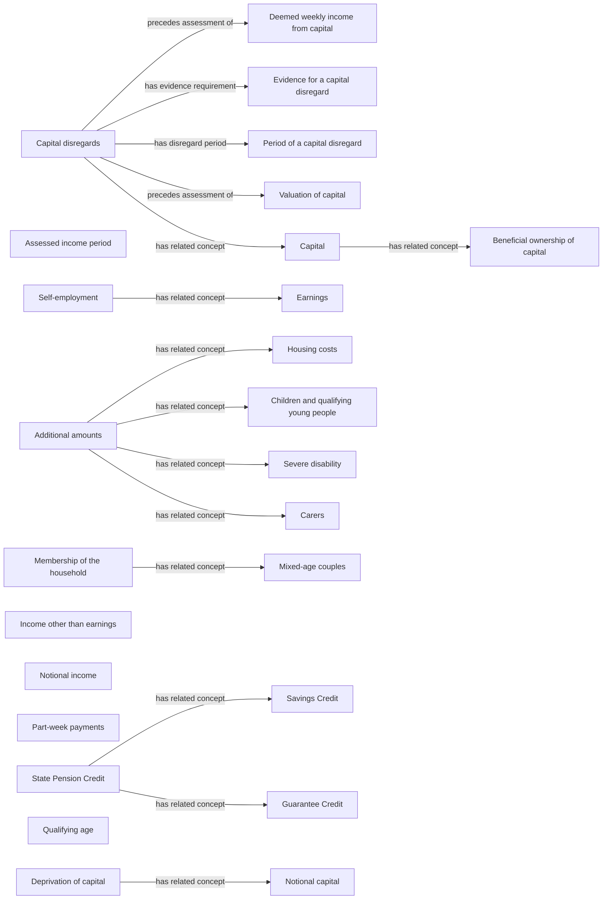

# Pension Credit semantic map

Model-assisted proposals from the frozen DWP guidance; all require specialist review. This map covers the authored concept set, not every concept or rule in the corpus. Disconnected concepts retain source navigation while relationship discovery remains open.

26 concepts; 15 proposed semantic relationships. Ordinary navigation and page containment are counted separately in coverage.json.

## Evidence register

| Source concept | Proposed relationship | Target concept | Evidence |
|---|---|---|---|
| [Capital](records/term/capital.md) | has related concept | [Beneficial ownership of capital](records/term/beneficial-ownership.md) | [DMG 84071–84073](https://assets.publishing.service.gov.uk/media/6a5e38bb8b7e4fa537e693d5/dmg-ch84.pdf#page=8) |
| [Deprivation of capital](records/term/deprivation-of-capital.md) | has related concept | [Notional capital](records/term/notional-capital.md) | [DMG 84781](https://assets.publishing.service.gov.uk/media/6a5e38bb8b7e4fa537e693d5/dmg-ch84.pdf#page=111) |
| [Capital disregards](records/term/capital-disregards.md) | precedes assessment of | [Deemed weekly income from capital](records/term/deemed-weekly-income.md) | [DMG 84355](https://assets.publishing.service.gov.uk/media/6a5e38bb8b7e4fa537e693d5/dmg-ch84.pdf#page=36) |
| [Capital disregards](records/term/capital-disregards.md) | has evidence requirement | [Evidence for a capital disregard](records/term/capital-disregard-evidence.md) | [DMG 84354](https://assets.publishing.service.gov.uk/media/6a5e38bb8b7e4fa537e693d5/dmg-ch84.pdf#page=36) |
| [State Pension Credit](records/term/pension-credit.md) | has related concept | [Savings Credit](records/term/savings-credit.md) | [DMG 77001](https://assets.publishing.service.gov.uk/media/68401a731d85c6606009cce4/dmgch77.pdf#page=3) |
| [Self-employment](records/term/self-employment.md) | has related concept | [Earnings](records/term/earnings.md) | [DMG 86200](https://assets.publishing.service.gov.uk/media/698462dd468d351e1406b4a7/dmgch86.pdf#page=44) |
| [Additional amounts](records/term/additional-amounts.md) | has related concept | [Housing costs](records/term/housing-costs.md) | [DMG 78001](https://assets.publishing.service.gov.uk/media/69e10327f5069cdc54868955/dmg-Ch-78.pdf#page=3) |
| [Capital disregards](records/term/capital-disregards.md) | has disregard period | [Period of a capital disregard](records/term/capital-disregard-period.md) | [DMG 84356](https://assets.publishing.service.gov.uk/media/6a5e38bb8b7e4fa537e693d5/dmg-ch84.pdf#page=36) |
| [Additional amounts](records/term/additional-amounts.md) | has related concept | [Children and qualifying young people](records/term/children.md) | [DMG 78001](https://assets.publishing.service.gov.uk/media/69e10327f5069cdc54868955/dmg-Ch-78.pdf#page=3) |
| [Additional amounts](records/term/additional-amounts.md) | has related concept | [Severe disability](records/term/severe-disability.md) | [DMG 78001](https://assets.publishing.service.gov.uk/media/69e10327f5069cdc54868955/dmg-Ch-78.pdf#page=3) |
| [Capital disregards](records/term/capital-disregards.md) | precedes assessment of | [Valuation of capital](records/term/capital-valuation.md) | [DMG 84355](https://assets.publishing.service.gov.uk/media/6a5e38bb8b7e4fa537e693d5/dmg-ch84.pdf#page=36) |
| [Capital disregards](records/term/capital-disregards.md) | has related concept | [Capital](records/term/capital.md) | [DMG 84351](https://assets.publishing.service.gov.uk/media/6a5e38bb8b7e4fa537e693d5/dmg-ch84.pdf#page=35) |
| [Additional amounts](records/term/additional-amounts.md) | has related concept | [Carers](records/term/carers.md) | [DMG 78001](https://assets.publishing.service.gov.uk/media/69e10327f5069cdc54868955/dmg-Ch-78.pdf#page=3) |
| [State Pension Credit](records/term/pension-credit.md) | has related concept | [Guarantee Credit](records/term/guarantee-credit.md) | [DMG 77001](https://assets.publishing.service.gov.uk/media/68401a731d85c6606009cce4/dmgch77.pdf#page=3) |
| [Membership of the household](records/term/household.md) | has related concept | [Mixed-age couples](records/term/mixed-age-couples.md) | [DMG chapter 77 section navigation, PDF page 18](https://assets.publishing.service.gov.uk/media/68401a731d85c6606009cce4/dmgch77.pdf#page=18) |
