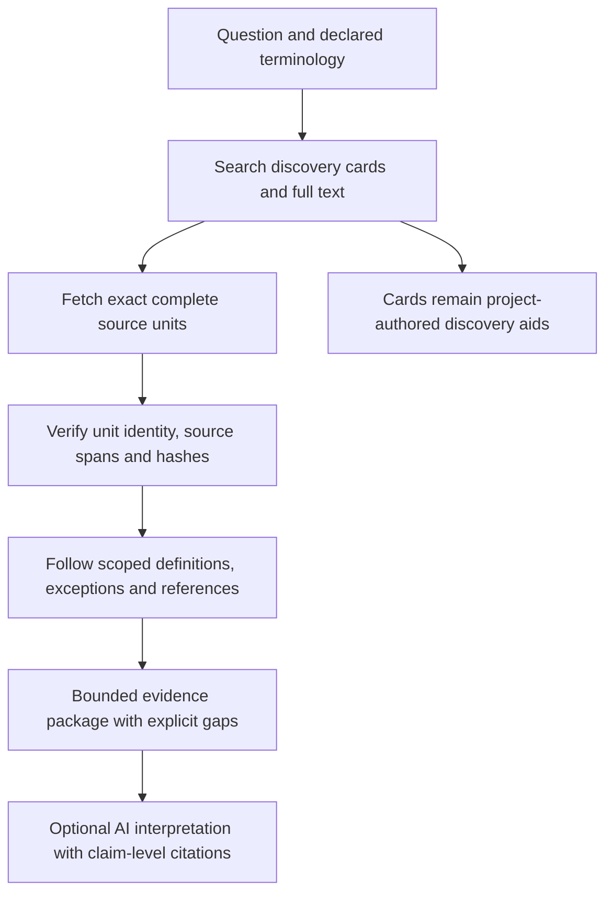

# Discovery cards and broader semantic coverage

**Status: two offline ranking probes completed; structural and semantic cards
remain proposed and unimplemented.** These probes do not change a production
source unit, profile, retrieval run or answer. This is an
independent experimental proposal, not official DWP guidance or specialist
acceptance. Read the [current delivery record](semantic-closure-and-compact-delivery.md)
and the [hash-bound diagnosis](../evaluation/semantic-coverage/discovery-card-diagnosis.json)
alongside it.

## What we tested before generating summaries

Two fixed-source probes use all 40 unchanged staff question occurrences. Each
protocol was committed before its implementation and observation, and a separate
agent independently recomputed the rankings. These are known development cases.

| Discovery method | Earlier candidate-location overlaps | Median text in 16 candidates |
| --- | ---: | ---: |
| Current literal ranking | 4 | 367,376 bytes |
| Additional tokens from declared aliases | 2 | 469,267 bytes |
| Length-aware BM25 ranking | 8 | 13,617 bytes |

BM25 is a lexical ranking formula which accounts for term frequency and passage
length. The alias shortcut is rejected for adoption. Length-aware ranking is a
useful lead for the next experiment, with four cases gaining a previously
identified location and none losing one. The 42 earlier locations are incomplete
review leads: their overlap is not an independently judged relevance or answer
score. Most shorter candidates still have unreviewed boundaries, and the Carer's
Allowance question still selects citizenship fragments. No live ranker changed.

The [alias probe](../evaluation/discovery-probe/README.md) and
[length-aware probe](../evaluation/discovery-probe/length-ranking.md) retain
protocols, every case, exact inputs, runners and independent reviews. Neither
experiment tests summary cards, graph closure or AI answers. The next comparison
must retain these simple baselines so that any improvement from summaries is
measured separately from an improvement in ranking.

## Would short summaries help?

Yes. A short, source-grounded description can help a person or AI find a passage
whose official terminology differs from the question. A **discovery card** is
that description plus the exact identity and location of the complete passage.
The card helps select evidence; the complete passage supplies the evidence.

This should be a general corpus capability. Writing a separate profile for every
question will not provide broad natural-language coverage. Profiles remain
useful for declaring which evidence and dependencies a known task requires.
Discovery cards should work when there is no such profile, while keeping that
absence visible.

The proposed sequence is:

Fetching a complete unit from its card is sometimes called **hydration**.
**Dependency closure** means finding its supporting definitions, exceptions and
updates, or explicitly recording what is still missing. Neither operation
establishes that a rule applies to a particular person.

## What the current evidence actually shows

Eight of 40 staff question occurrences activate a logical-unit profile. That is
not an answer-quality or retrieval-relevance score. The retained 512 KiB results
show that:

- all 32 occurrences without a profile still return candidate source evidence;
- 10 of those 32 also return relationships, while 22 return none;
- every staff result remains insufficient;
- Staff 019, “How does Pension Credit work?”, returns 34 evidence records and
  31 relationships without an activated completeness profile;
- the two identical Staff 026/033 questions remain two occurrences, not two
  independent demonstrations of generalisation.

Candidate evidence may still be irrelevant, incomplete or the wrong regime.
The [coverage ledger](../evaluation/semantic-coverage/closure-2026-09-22/audit.json)
keeps source candidates, profile requirements, observed retention and unresolved
obligations separate. The new diagnosis binds the 32 retained result identities;
it does not claim to have re-executed them or archived their full packages.

### A concrete terminology gap: savings and Pension Credit

Staff 006 asks: “What is the maximum you can have in savings to still qualify for
Pension Credit?” The declared vocabulary already maps **savings** to **capital**
and **Pension Credit** to **State Pension Credit**, including the abbreviation
**SPC**. Resolution recognises these concepts.

However, the current producer indexes only each unit's literal text. The
retriever ranks original question tokens after removing ordinary question words;
it does not expand them using resolved concept aliases or search the catalogue's
labels and heading paths. It chooses 16 lexical candidates before graph
expansion. These details are bound to the actual producer and approved Explorer
engine in the diagnosis.

Frozen DMG Chapter 84 paragraph 84911 uses “deemed weekly income from capital”.
Paragraphs 84921–84922 concern total capital and when income becomes capital.
Chapter 77 paragraphs 77303–77304 distinguish Guarantee Credit and Savings
Credit. A card can connect these terms to the question without pretending that
the passage establishes a single maximum savings limit. The headings, definitions,
disregards, income treatment, household rules and source date still need review.

The exact locations are the existing candidates `source-c031` (Chapter 84,
PDF page 128), `source-c012` (Chapter 77, page 33), `source-c008` (Chapter 77,
page 14) and `source-c032` (Chapter 85, page 30). Their source hashes, excerpt
hashes and current overlapping unit IDs are recorded in the diagnosis. These
are review leads, not an exhaustive answer key.

### A structural problem must be addressed first

The machine catalogue assigns paragraph **77031**, the SPC entitlement gateway,
this heading candidate:

> Qualifying income and savings credit threshold 77053 - 77099

The paragraph number is outside that heading's range. The exact frozen text is
in [Chapter 77 extraction, PDF pages 14–15](../source/pages/dmg-vol13-ch77.json),
with the source starting at [official PDF page 14](https://assets.publishing.service.gov.uk/media/68401a731d85c6606009cce4/dmgch77.pdf#page=14).
The catalogue is
[`dmg-vol13-ch77.json.gz`](../logical-units/documents/dmg/dmg-vol13-ch77.json.gz),
unit key `section-0050-guidance-77031-occurrence-0001`.

There is an ADM example too: the P4087 machine candidate inherits
“Residence and Presence conditions P4097 - P4999”, outside its paragraph range.
See [frozen ADM P4 extraction](../source/adm-2026-09-19/pages/adm-chapter-p4.json),
[official PDF page 18](https://assets.publishing.service.gov.uk/media/67f670a332b0da5c2a09e23d/adm_p4.pdf#page=18)
and unit key `section-0058-guidance-p4087-occurrence-0002` in the
[P4 catalogue](../logical-units/documents/adm/adm-chapter-p4.json.gz).

A bounded check of Chapter 77 and ADM C1/P1/P4 found **16 range mismatches among
26 machine candidates with comparable heading ranges**. This is a diagnostic
sample, not a corpus-wide error rate. It does not prove that the other headings
are correct. The producer carries forward the last detected heading; miniature
contents lists within a document can therefore supply an inappropriate parent.
These candidates already declare their boundaries and headings uncertain.

Blindly summarising every candidate using that inherited heading would spread
the error. The next pass must distinguish a detected heading from a checked
governing heading, detect contents lists and check paragraph-range containment.
It should retain uncertain material rather than silently discard or relabel it.

## Proposed card design

Start with two separately labelled layers:

1. **Structural discovery card:** document and source family, paragraph identity,
   checked section path, literal heading, boundary-review status, source date
   roles, full unit ID, source spans and hashes. Record unresolved hierarchy.
2. **Semantic discovery card:** concise subject and scope, benefit or component,
   circumstance, important distinctions, and named definitions, exceptions or
   references. Every field has source support and its own review status. A
   model-written description remains model-derived even when it links to an
   official source.

Use bounded fields and a separate immutable card identity. Record the producer,
version and source snapshot; for model generation also retain the model, prompt,
input and output identities. A changed source hash invalidates the old card's
binding. Cards cannot overwrite literal source text or satisfy evidence
requirements merely because their descriptions sound relevant.

Use short document and section cards to organise unit cards. Search both this
hierarchy and the existing full-text channel: selecting one chapter must not
hide a cross-chapter definition or income rule. Distinguish candidate navigation
links from reviewed `references` and `requires` relationships. A mention of two
benefits is not an interaction rule.

For example, an ADM C1988 card should distinguish medical-purpose temporary
absence from general absence. The complete existing unit includes conditions,
its note, three examples and the memo reference across PDF pages 121–122. A
description such as “UC abroad for six months” would lose the governing purpose,
conditions and dependency. The linked unit and the scoped memo route must still
be read. Likewise, P4 P4051 concerns mobility-component overlapping payments;
it must not become a generic PIP interaction answer just because JSA and ESA
occur in the cited regulations' title.

Full-unit reads must verify the expected snapshot, ID, hash and ordered spans.
Follow admitted dependencies within explicit limits. If a complete unit or its
qualifications exceed the package budget, return a manifest and exact bounded
reads or an explicit omission. Do not replace the missing source with its card.

## A measurable bounded experiment

Keep the current source snapshot, all 40 question occurrences, budgets and
existing profiles fixed. Add an experimental discovery index alongside them.
Do not tune source descriptions to the supplied questions or add per-question
aliases, paths or profiles to improve the comparison.

Begin with complete source-led sections in DMG Chapters 77/84/85 and ADM
C1/P1/P4/P5. Generate cards across those selected sections, including passages
which are not answers to a staff question. Keep the original discovery channel
for the rest of the corpus. Describe this as a bounded experiment, not coverage
of all 513 documents.

| Arm | Discovery input | What the comparison isolates |
| --- | --- | --- |
| A | Current literal-text index and authored graph | Frozen baseline |
| B | A plus checked structural cards and governed expansion of declared terminology | Gains from available headings, aliases and hierarchy without model summaries |
| C | B plus source-grounded semantic summary cards | Additional gains and errors from summarisation |

Freeze each arm's card hashes and ranking settings before evaluating. Summaries
must be generated from the passage and relevant source context, without the
evaluation questions. Where meaning or hierarchy is uncertain, the card must
say so. Review a stratified sample including DMG/ADM, tables, examples, memos,
cross-page units and uncertain boundaries before scaling up. An optional later
embedding experiment should be a separate arm, not silently bundled with C.

Use all 40 unchanged staff questions to report continuity, while acknowledging
they are known development cases. After freezing the cards, a different reviewer
should supply genuinely unseen paraphrases and scenarios. Freeze those separately
and do not edit the cards in response before scoring. The controls should include:

- savings, capital and income wording; an assumed capital ceiling must not be
  accepted as a fact merely because the question suggests one;
- general benefit questions with the benefit omitted, including Staff 018's
  missing benefit and Staff 016's unspecified earlier inputs;
- ambiguous SDA and unclear scheme names, rather than silently choosing a meaning;
- domestic travel versus abroad, and general versus medical or emergency absence;
- PIP existing-award continuation versus a first claim after pension age;
- JSA/ESA names occurring only in citation titles, wrong benefit variants and
  chapter contents entries presented as if they were operative rules;
- historical rates and example amounts queried as current rates;
- an unknown topic, an absent definition and the already recorded P4019/P4051
  source-scope mismatch.

Do not call new controls held out merely because their wording changed. Keep
their authoring process and exposure separate from card and ranker development.

### Measures and acceptance boundaries

Report these separately for each question and arm:

| Measure | What it establishes |
| --- | --- |
| Candidate relevance at fixed ranks | Whether useful passages can be found; use independently judged source passages and allow “not yet judged” |
| Complete-unit and qualification retention | Whether actual whole evidence, examples and scoped dependencies survive assembly |
| Declared path retention | Whether the existing tested routes survive; unchanged denominator where comparing arms |
| Concept ambiguity and missing evidence | Whether the system preserves unknown meaning, absent sources and unanswered scope |
| Supported claims and qualification loss | Whether a later model answer is justified by delivered source, not by the cards or model knowledge |
| Bytes and cost | Card index, transferred source, assembled evidence, output bytes, generation tokens and measured cost |
| Performance | Cold and warm reads, requests and measured latency, with local and remote observations separated |

The 42 earlier source candidates can seed relevance review but are not a complete
gold-standard answer set. The 203 original obligations remain open unless their
own review process establishes closure. All 32 currently unprofiled occurrences
must be reported, including those outside the initial section scope.

For later answer trials, hold the model, prompt and question fixed across arms,
record the exact delivered package, and assess each claim against hydrated source
evidence. Separately test answer generation on one identical package to isolate
model behaviour from retrieval. No such trial or affordability result is claimed
by this diagnosis.

An arm should not advance if it improves lexical recall by silently changing
authority, dropping qualifications, guessing an ambiguity or hiding truncation.
The first decision is whether B improves independently judged relevant-unit
retrieval at the same budgets. Only then is C's extra generation cost and error
surface justified for a measured comparison.

## What remains to implement

1. Review the bounded hierarchy defects and define a versioned structural-card
   contract without changing historical unit identities.
2. Build the independent discovery index and generic field/alias ranking arm B,
   preserving full-text discovery and explanation of each match.
3. Freeze source-led summary cards for arm C, with source-span support and
   explicit uncertainty.
4. Run the unchanged staff suite, independent relevance review and unseen
   controls; retain failures and all earlier results.
5. Extend section coverage only after these measures justify the method.

This is a broader discovery workstream alongside semantic source review. It
does not remove the need to model definitions, benefit variants, exceptions,
directional interactions or legal-version dependencies.
