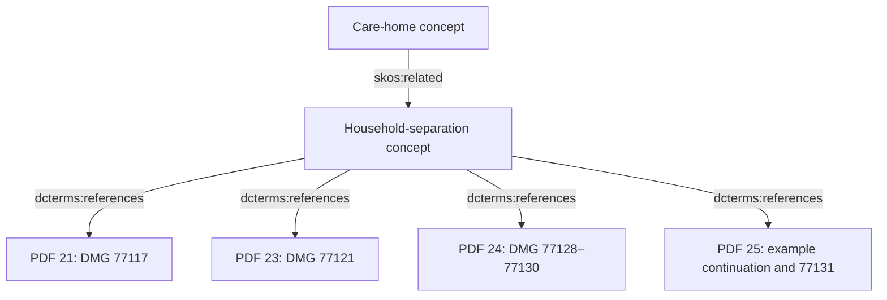

# Household qualifications lost under the context budget

Review date: 21 September 2026. **Model-authored source and implementation review; not specialist acceptance or current legal advice.** No source, profile, generated index or frozen trial was changed for this review. No obligation is newly closed.

## What was found

The Staff012 trial already had access to the captured guidance distinguishing one partner from both partners living permanently in a care home. The pages were present in the frozen full corpus and semantic index, and reachable through existing relationships. The assembled package omitted them to meet its byte budget while retaining the project-authored household summary and the statutory regulation 5 body.

This is a context selection and declared-dependency gap. Acquiring the same manual again would not resolve it. The package correctly remains `insufficient` and `truncated`; that overall warning does not ensure that each surviving interpretation is accompanied by its controlling qualifications.

Staff012 asks: “Does Pension Credit stop is a citizen moves into a care home permanently if they are self-funding?” The original wording is preserved. Household status, benefit components, funding, qualifying-benefit payment and relevant dates remain unresolved.

## Immutable evidence reviewed

The [frozen trial manifest](../evaluation/model-comparison/household-2026-09-21/frozen/manifest.json) binds DWP commit `3ef0e786e9a18e76fa17c7d925ff509d6d6c9f84` and Explorer commit `0e6a639f87c4060123b72d82c1ebe30405d475f1`.

| Retained artefact | SHA-256 |
| --- | --- |
| Frozen trial manifest | `9fd2755fa6b0ac36345c4245162da97565f1a27b37b8b11e990a803c5f6a7719` |
| [Staff012 context file](../evaluation/model-comparison/household-2026-09-21/frozen/contexts/staff-012.json), 257,861 bytes | `c3dd08c848e1203cb5c07518e3819bc7c4ef0116dd3096d99f54ea48187b5012` |
| [Frozen semantic index](../evaluation/model-comparison/household-2026-09-21/frozen/input-snapshots/assembly-index.json), 4,581,721 bytes | `f3e74d970b18aaaa39a78dd6cbd7fce3bca15ca457d63704c5743936718b4587` |
| [Frozen corpus manifest](../evaluation/model-comparison/household-2026-09-21/frozen/input-snapshots/corpus-manifest.json) | `aa9726ba72b7495323b031f149fa13cffeae0aa8fc868af63b7af3cac0e6be95` |
| [Corpus record shard containing the qualification pages](../context/corpus/records/0000.json.gz) | `3039a5b4cbe6c89068ae726a94f4689a931b3d91398f7b857d3e6d54297c75fa` |
| Frozen Explorer `apps/okf-explorer/src/lib/context/index.ts` | `bade207cbc414b9a057778fdc28564d1c0f9c03e7548b3644a3fb9ec9b8731e6` |

The context identity is `urn:sha256:b83bb636c3fbef3669b4aba03eb6cc3e4a5adda2b6e1ab50990a625e32893771`. Its recipe binds `https://example.test/monday-corpus/manifest.json` with digest `bedb2795b5579c55814b1367cc6fc04ff6f8eb681eba42a4120120e1da286c57`. That URL is the offline replay identity, not a public evidence service. The context identity, serialised file digest and recipe-manifest digest have different purposes and must not be interchanged.

### Guidance dates and extraction

The retained [Chapter 77 PDF](../source/pdf/dmg-vol13-ch77.pdf) is the [official DWP attachment](https://assets.publishing.service.gov.uk/media/68401a731d85c6606009cce4/dmgch77.pdf). Its SHA-256 is `0528f2fb95ac3bd71bdff0d91cdaba5df76ab4260396ca99608c840004ff5708`. The [whole-page extraction](../source/pages/dmg-vol13-ch77.json) has SHA-256 `f7c34c30310a5e1f4700fb00b291e2bdec89554a89d4c244a9762c16c7448f19`.

The retained [inventory](../source/inventory.json) records:

- capture at **15 September 2026, 14:21:01 UTC**;
- HTTP `Last-Modified` of **4 June 2025, 10:05:39 GMT** for the PDF;
- parent publication update of **20 July 2026, 16:39:55 BST**.

These are distinct acquisition and publication observations. None establishes the commencement, continuing applicability or amendment status of an individual paragraph. The extraction uses `pdftotext -layout -enc UTF-8`, has not had specialist review and uses one-based PDF page indices. The full-DMG inventory reuses this pilot acquisition; its files remain under `source/pages` and `source/pdf`.

### Statutory version

The selected statutory record is `https://chris-page-gov.github.io/okf-dwp/id/legal-body/uksi/2002/1792/regulation/5`, linked to [regulation 5 at the requested 20 September 2026 version](https://www.legislation.gov.uk/uksi/2002/1792/regulation/5/2026-09-20).

- Capture: `2026-09-20T21:29:53.614046+00:00`.
- Observed HTTP body hash: `898e58d6e6bea9fe234d531c65570a1019c74aaa2ba6b43a0d717d7dbb0db35d`. The original response is **not retained publicly**.
- [Retained lossy XML-tree projection](../source/legal-bodies-2026-09-21-v2/provisions/uksi--2002--1792--regulation--5.json) hash: `222f597a3505ae3be047795bfd0d9b72d36a76e6b9e2004b9422666be5c58def`.
- Extracted statutory text hash: `e43e6faad06f6487f72144734d193c740073afd95e07e61a397b84f73b7aabfb`.

The requested version date is not a commencement finding. Territorial extent, amendment reconciliation and applicability remain unestablished. The selected wording of regulation 5(1)(b) refers to permanent residence by the person or claimant. This review does not independently resolve that provision's legal interaction with the guidance's one-partner/both-partners branches or the cited judgment.

## Controlling qualifications in the captured guidance

For the tables below, `id:` means the stable prefix `https://chris-page-gov.github.io/okf-dwp/id/`. These are identifiers, not newly authored propositions of law.

| Whole-page record | Paragraphs and qualification to preserve | Outgoing references in the source text |
| --- | --- | --- |
| `id:page/77/0021` | **77117:** permanent care-home or independent-hospital residence is one household-treatment branch. Living away, detention, overseas absence and immigration restrictions are separate branches. | Relevant care-home footnote: **SPC Regulations 5(1)(b)**. Other numbered footnotes belong to their own branches. |
| `id:page/77/0023` | **77121:** when both partners, or all members of a polygamous marriage, are permanently in a care home, independent hospital or sheltered accommodation, normal household rules apply and each case depends on its facts. **77122–77123:** the exception for a likely absence exceeding 52 weeks belongs to that absence branch. | 77121 routes to **77128 onwards**; 77122 cites **SPC Regulations 5(1)(a)(ii)**. Do not recast this as a blanket care-home exception. |
| `id:page/77/0024` | **77128:** one partner entering permanently and both partners living there permanently require different treatment. For both, establish whether they nevertheless form the same household. **77129–77130:** fact and degree, a domestic establishment, reasonable independence and responsibility; seven non-exhaustive factors, none decisive alone. The first example begins here. | **77005 onwards**, **77117(2)** and **R(IS) 1/99**. The judgment body is not supplied by the statutory-body acquisition. |
| `id:page/77/0025` | Completes the first example with a same-household conclusion, then gives two contrasting examples. **77131:** sheltered accommodation has its own description and branch. Page 24 alone leaves an example unfinished. | The examples and 77131 continue the immediately preceding household discussion. |
| `id:page/77/0019` | **77100–77102:** household membership affects the award and assessment of income, earnings and capital; sharing a dwelling alone does not establish one household. | **R(SB) 4/83** and **Santos v Santos [1972] All ER 246**. No judgment-body or applicability acceptance is claimed here. |
| `id:page/77/0007` | **77013:** relevant couple definition, if the proposed answer explains that term. | Keep the exact source's scope when explaining partner or couple status. |

The core four pages have these literal text hashes, as recorded in the frozen semantic index:

| PDF page | SHA-256 |
| --- | --- |
| 21 | `17ca407fd315e9ef645e0c7ffd58aabed7d27805f1a10629557353c6c84f1133` |
| 23 | `d6a01981d4e119680f32737e6d236199e2b3683c23b0770443cdf80c00ad4b35` |
| 24 | `617b15668bd7233b6161a36d30d86201be5fdf6df9e702b84fb1b9733b40392e` |
| 25 | `3550ae19586e3de78e595dd4f7a218a90cf079f4cbd81c0c4894fae299c2971c` |

This supports a source-qualified distinction between the one-partner and both-partners branches. It does not establish a claimant's household status, an award or a definitive statutory interpretation.

## Existing graph and the budget proof

The graph already contains the following path. These are **model-derived research navigation assertions**, not official DWP assertions:

Exact assertion identifiers use `id:assertion/staff-semantic/` plus:

| Relationship | Identifier suffix |
| --- | --- |
| `staff-domain/care-home` → `staff-domain/household-separation` | `11322b675c1d17d71c479790cc682c0262970eac0214277877b3a1dac50d6bb6` |
| Household separation → page 21 | `a5d8f2c3d6a886e1bca09268e49f1156e5c6f69331bb45cb751f4ba4c6664fe3` |
| Household separation → page 23 | `d9c7fb658a90b3e9e9b51a9ffd8236291495379d0b8bd89e5704ddd8ed6277e5` |
| Household separation → page 24 | `4cc1734223f272223402550f0ed3168f82733dbe1e865e8ce0d82fb8ac03bc70` |
| Household separation → page 25 | `2fb14090a2815b940883ab709eb75cd055be5004f3ad07c33f36380c221b20bd` |

The four page records have no outgoing assertions in this semantic index. Their textual paragraph and judgment references should not be reported as already implemented traversal edges.

The frozen Staff012 package has a maximum of 262,144 bytes, 64 nodes, 128 relationships and depth 6. It retains **35 records and 50 relationships**, uses **257,861 bytes**, and reports `evidence_status: insufficient` and `budget.truncated: true`. Its `budget.omissions` explicitly contains a `byte_budget` entry for each of pages **77/21, 77/23, 77/24 and 77/25**: a whole item was omitted to meet the package budget.

The surviving `staff-domain/household-separation` record still states the one-partner/both-partners distinction. Of its eight linked guidance pages, only **77/20 and 78/25** survive. Pages **77/7, 77/19, 77/21, 77/23, 77/24 and 77/25** do not. Its authored provenance and status remain visible, but the primary-source material establishing the distinction is absent from the package.

The same mechanism affects other selected authored concepts:

| Selected authored concept | Linked pages retained | Linked pages omitted |
| --- | --- | --- |
| `care-home-housing-costs` | 78/58 | 78/53–78/57 |
| `no-partner-disability-addition` | 78/25 | 78/11, 78/12, 78/15, 78/21–78/23 |
| `temporary-care-home` | 78/25 | 78/24 |
| `severe-disability-addition` | 78/25 | 78/11 |

This table records dependency exposure, not a finding that every omitted page is necessary for every possible statement. A claim needs explicit, bounded qualification dependencies rather than an assumption that all navigation links establish evidence completeness.

## Why the declared requirements did not protect the pages

The frozen `id:requirement/staff/staff-012` requires only the original candidate pages **78/25, 78/58 and 77/20**, their declared paths, and five deliberately unresolved obligation IDs. Its prose discusses the added household branches, but its machine-readable required-page list does not include them.

At the inspected producer version, `scripts/build_staff_semantic.py` derives `required` from the original `candidate_ids`. Additional concept source pages become traversable records; they do not automatically become profile requirements. This is the domain-side mismatch between the expressed review scope and the declared evidence dependency.

In the frozen Explorer engine, applicable requirements are calculated after breadth-first traversal. Byte trimming removes the last inserted selection, removes its incident relationships, and refreshes requirement diagnostics. It does not reserve room for declared required paths before optional expansion. These are generic allocation behaviours; they should not be corrected by encoding DWP paragraph numbers in Explorer.

Explorer already supports `dcterms:requires` as well as `dcterms:references`, and has missing-dependency diagnostics. However, trimming removes incident relationships, so a removed dependency edge must not erase the original dependency obligation. Requirements and dependency checks need to refer to the declared graph, not only the surviving relationship list.

## Smallest proposed additive change

These are implementation proposals, not changes made by this review:

1. **Declare the household qualification group in authored data.** For the proposed one-partner/both-partners explanation, require the existing whole-page records **77/21, 77/23, 77/24 and 77/25**. Add **77/19** when asserting the domestic-establishment meaning and **77/7** when explaining the couple definition. Keep regulation 5 as a distinct statutory source whose interpretation remains unreconciled.
2. **Compile those declarations into existing `required` and `required_paths` fields.** Reuse the existing `skos:related` and `dcterms:references` paths. Where a record-level dependency is useful, the already-supported `dcterms:requires` predicate is sufficient; no new legal predicate is needed. Any new assertion must retain model-derived/project-authored status and source provenance.
3. **Allocate explicit requirements before optional expansion.** Give the generic assembler the declared dependency closure early enough to budget for it. Keep page 24 with page 25's example continuation. Do not automatically promote every navigation reference to a required dependency.
4. **Fail closed at the affected interpretation.** If the qualification group cannot fit, retain precise missing-dependency diagnostics. Either omit the dependent authored interpretation or clearly identify its missing primary-source support. An overall insufficient status alone is too easy for a consumer to overlook.
5. **Add a regression and a new versioned trial.** Verify that the controlling pages and their paths survive, or that their absence prevents presenting the interpretation as supported. Check that an authored summary cannot silently outlive its declared evidence dependencies. Keep the existing frozen trial, source hashes and failed/successful observations unchanged.

## Obligations affected and still open

The proposed change would reduce the **household-qualification portion** of:

`https://chris-page-gov.github.io/okf-dwp/id/obligation/staff/staff-012/evidence_closure_unverified/source-requirement-1`

It would not close that obligation: qualifying-benefit payment, funding/timing, housing exceptions, other cross-references and legal reconciliation remain. Shared care-home profiles may benefit, but each needs its own declared scope and verification.

These Staff012 obligations remain unchanged and open:

- `applicability_unresolved/applicability` — regime, date and territory;
- `legal_version_unreconciled/legal-version` — provisions, amendments and judgments, including the absent R(IS) 1/99 body;
- `independent_review_pending/meaning-review` — an attributable specialist decision on the exact version;
- `question_scope_unresolved/question-scope` — including whether one or both partners live in the home.

Knowing which facts and source branches are needed does not establish those facts. This review makes the evidence-selection failure reproducible and proposes a reusable remedy; it does not settle entitlement or legal applicability.
