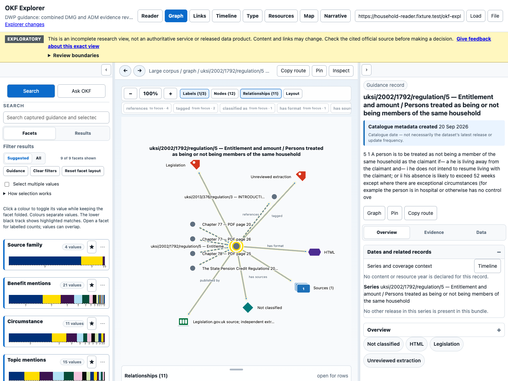

# Household Reader verification

The household candidate passed the same local browser journey in Chrome, Firefox
and WebKit on 20 September 2026. These observations test the actual Explorer
interface with hash-bound local corpus files. They do not establish that this
candidate has been publicly deployed or that its benefits interpretation is
legally complete.

## What a beginner can inspect

**Reader** displays a source record. **Graph** shows the relationships connecting
records. **Timeline** distinguishes when source material was published from when
the project captured or generated its catalogue. **Ask OKF** assembles a bounded
evidence package; it does not make a benefits decision or generate an AI answer.

The **Legislation** source-family filter contains 20 selected statutory units.
A unit is a section, regulation or schedule paragraph, not an entire Act or set
of regulations. The test opened every unit and compared its visible text with
the retained normalised extraction, including its qualifications. It also checked
the official dated HTML link. This establishes display parity with the extraction;
it does not establish that extraction is a complete transcription of every
editorial annotation or amendment structure in the original source.

The filter retained the same 20-record scope in Reader, Graph and Timeline.
Choosing source dates produced no publication events for these records: the
requested version, **20 September 2026**, is not their publication or commencement
date. Choosing audit dates showed catalogue activity separately.

For regulation 5 of the State Pension Credit Regulations 2002, the graph displayed
incoming references from the captured DMG pages and outgoing navigation to the
Universal Credit Regulations 2013 couple definition. DMG means *Decision makers’
guide*. A reference is a route to inspect; it does not establish that the linked
rule applies to an individual claimant.



## What the two questions demonstrated

The exact retained staff wording was used, including its original typographical
error:

> Does Pension Credit stop is a citizen moves into a care home permanently if they are self-funding?

The selected whole page containing DMG 78088 also contained the heading
“Claimants who have no partner (including self- funders)”. The test opened its
source passage and verified that this limiting heading remained visible. It did
not treat the paragraph as a rule for every couple or every award component.

The second question was:

> What was the SDA amount over the last five years?

SDA can identify Severe Disablement Allowance or shorthand for a Pension Credit
severe-disability addition. Both alternative branches were visibly labelled;
neither became a resolved meaning. No complete five-year rate answer was claimed.

| Package | Selected records | Relationships | Compact JSON bytes | Result |
| --- | ---: | ---: | ---: | --- |
| Care home | 64 | 118 | 481,384 | Insufficient; truncated |
| SDA | 64 | 99 | 477,692 | Insufficient; truncated |

Both packages used the browser defaults: 64 records, 128 relationships, depth 6
and 524,288 bytes. Missing evidence and budget omissions remain in the JSON.
For example, the care-home package omits some housing-cost statutory units at the
node limit. These omissions matter: seeing the controlling heading does not make
the overall question answerable. The remote compact service and fixed-evidence
model trials use different delivery budgets and may have different context IDs.

All three browsers returned the same care-home context ID and the same SDA
context ID. The narrow 390-pixel viewport reproduced the SDA package using
keyboard navigation, kept focus on the JSON disclosure and had no page-level
horizontal overflow. Targeted axe checks found no violations in Ask OKF and the
named narrow-panel controls. WebKit used its macOS **Option+Tab** navigation
convention. No physical phone, human screen-reader session or full accessibility
audit was performed.

## Exact identities and observations

- Reader snapshot: `dwp-combined-7e7910d4be2c0d52556b`.
- Context snapshot: `dwp-combined-context-8082d887c8e9d5ff6d91`.
- Application tree: `c0666ae2659d3cf3eba8a19c41c5d9873adefb5514134823f54549fcabc0a0d2`.
- Application manifest: `a551e1601d7722cea6edfe4e613a4fcc44191d8dfc74a0368b67b6a33f8d6f0c`.

The Reader and context snapshots identify different projections. The context
manifest explicitly binds its semantic source to the Reader snapshot. The test
checks that relationship and the package’s manifest digest instead of assuming
the two snapshot strings must be identical.

| Browser | Version | Whole local journey |
| --- | --- | ---: |
| Chrome | 153.0.8010.52 | 6.2 seconds |
| Firefox | 153.0 | 9.2 seconds |
| WebKit | 26.5 | 10.2 seconds |

These are single local runs with intercepted corpus bytes, not public-network
performance benchmarks. Each observation records phase timings and every served
file digest. Firefox and WebKit ran concurrently, so the timings are not a
controlled browser comparison.

The [evidence inventory](../validation/household-reader/README.md) links receipts,
screenshots, complete packages and two retained failed harness attempts. The first
attempt omitted opening the existing Relationships menu. The second incorrectly
expected identical Reader and context snapshot strings. The final harness fixed
those assumptions without changing the application or corpus, and all three
browsers then passed in fresh directories. Failures are not counted as passes.

## Reproduce the local checks

Use the isolated Explorer checkout with the exact application build above and its
installed Playwright dependencies. From the DWP repository, start the assembled
Site in a separate terminal:

```sh
export OKF_EXPLORER_CHECKOUT=/path/to/okf-explorer
python3 -m http.server 8015 --bind 127.0.0.1 \
  --directory "$OKF_EXPLORER_CHECKOUT/_site"
```

Then run each engine into a new directory. The harness refuses existing files,
directories and symlinks before loading browser dependencies, so a rerun cannot
overwrite a prior observation.

```sh
export OKF_EXPLORER_CHECKOUT=/path/to/okf-explorer
export OKF_HOUSEHOLD_APP_MANIFEST_SHA256=a551e1601d7722cea6edfe4e613a4fcc44191d8dfc74a0368b67b6a33f8d6f0c
export OKF_HOUSEHOLD_SNAPSHOT=dwp-combined-7e7910d4be2c0d52556b
OKF_HOUSEHOLD_BROWSER=chrome OKF_HOUSEHOLD_OUTPUT=/tmp/household-fresh-chrome \
  node scripts/check_household_reader_browser.mjs
```

Repeat with `firefox` and `webkit` and distinct fresh output directories. The
browser runtimes must already be installed. Stop the local server after the run.
Do not replace the retained observations or treat a changed application/corpus
identity as the same test.

Check the retained evidence and offline controls without opening a browser:

```sh
node --test scripts/test_household_reader_browser.mjs
uv run --locked python scripts/check_household_reader_observations.py
uv run --locked python -m unittest discover -s scripts \
  -p test_household_reader_observations.py
```

See [household evidence expansion](household-evidence-expansion.md) for the
semantic scope and [selected statutory evidence](legal-body-evidence.md) for
acquisition limitations and unresolved legal dependencies.
