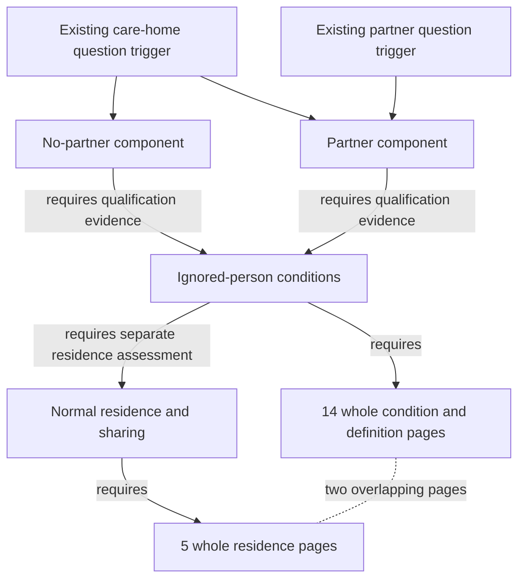

# Ignored persons and normal residence: qualification review

21 September 2026. **Independent experimental source modelling. Specialist review
and current-law reconciliation remain outstanding.** This increment makes the
captured evidence and its conditions easier to inspect. It does not decide an
individual award or establish that a staff question describes a qualifying person.

## What changed

Two model-authored concepts separate two different questions:

- **Normal residence:** whether another person usually lives with the claimant,
  and whether their accommodation is shared for this particular test.
- **Ignored presence:** whether a person whose presence would otherwise matter
  can be disregarded for the residence condition of the Pension Credit
  severe-disability additional amount.

Ignoring someone for that condition does not remove them from every household
assessment. Nor does a shared address establish whether partners remain one
household. Existing partner, no-partner, household-separation and dated Scottish
amendment concepts keep their separate roles.

The two existing disability-addition branches now declare that they require the
ignored-person qualifications; that concept requires the distinct normal-residence
support. Existing Staff 012/013 care-home and Staff 014/017 partner component
investigations inherit the closure. **The profile authoring, question text,
triggers, ambiguities and all 203 obligation objects are unchanged.** None of the
40 original question occurrences expressly asks about ignored persons: these
are conditional dependencies of existing component investigations, not new facts.



The graph uses existing `skos:related` associations and `dcterms:requires`
evidence dependencies. These relationships are **model-derived proposals**, not
statutory applicability assertions. No schema, producer limit or engine behaviour
changed. The overview does not gain a blanket dependency; there is no dependency
cycle. The temporary-care-home component remains optional: page 78/24 is required
to finish the shared-lives example, not to activate the later temporary-care-home
heading printed on the same page.

## Source conditions retained

The source is the already captured DWP Decision makers’ guide (DMG), a departmental
staff guide. Whole PDF pages retain the surrounding conditions, footnotes and
examples. Page numbers below are one-based PDF pages, not paragraph numbers.

| Passage | Qualification that must remain visible |
| --- | --- |
| DMG 78065–78076, Chapter 78 pages 17–21 | Normal residence is a factual assessment. Exceptional visits, temporary absence, university residence and an overnight carer need their own enquiries. A shared address alone is not decisive. |
| 78068–78074, pages 18–21 | Sharing only a bathroom, lavatory or communal area differs from kitchen sharing. Stored items or meal preparation can matter even without entering the kitchen; passing through to a self-contained flat differs. Separate liabilities must meet the legal-payment and same-landlord conditions. |
| 78077, pages 21–22 | Preserve all six categories: under 18; the listed benefit/component receipt; certified or treated blindness; a resident carer engaged by a charging charitable or voluntary organisation; that carer’s partner; and a source-defined qualifying young person, or a child for Child Benefit purposes. The qualifying-young-person branch refers separately to regulation 4A. |
| 78006/78008/78011, pages 5–6 | The source’s “AA” has a defined meaning beyond an unqualified acronym. Treated blindness has a 28-week limit. A voluntary organisation is non-profit and is not a public or local authority. |
| 78078(1), pages 22–23 | First joining to care for the claimant or partner, qualifying immediately beforehand, and only the first 12 weeks must be read together. An overnight stay alone does not establish this exception. |
| 78078(2)/78079, pages 22–23 | Keep the non-close-relative restriction, both directions of commercial liability and membership of that person’s household. Legal liability and a comparable lodger payment are required; money changing hands alone is insufficient. |
| 78078(3)–(5), pages 22–23 | Joint occupation plus co-ownership or joint liability to the same landlord has the non-close-relative and partner branches. The close-relative exception requires satisfying item 3 or 4 as well as the before-11-April-1988 or later on/before-first-occupation condition. The note uses the right-to-occupy date. |
| 77011–77012, Chapter 77 page 7 | Close relative has named legal, adoptive and half-sibling meanings; it is not a blood-relative shortcut. |
| 77019–77028, Chapter 77 pages 9–11 | Age, education or training, benefit receipt and interruptions have detailed conditions and continuations. Neither being under 20 nor being in education is enough. The literal cross-references remain unreconciled where necessary. |
| 78080, Chapter 78 pages 23–24 | Registered shared lives, support, accommodation and commercial liability retain the exclusion for other people who cannot be ignored. Page 24 finishes the example; £395/week is a historical example, not a current rate or threshold. |
| 78055–78060, pages 15–17 | Receipt and actual caring-payment conditions have separate qualifications. The partner-patient item is not silently transferred to an ignored third person. |
| Memo 02/25 page 5, paragraph 15 | Pension Age Disability Payment (PADP) enters this ignored-person benefit list from 21 October 2024. The neighbouring claimant/partner and housing-deduction amendments are separate propositions. |

DMG 78087 on page 78/25, already retained by the care-home branch, says the other
permanent care-home residents do not normally reside with the claimant because
of separate payment liabilities. This is not renamed as an ignored-person
category. Household membership after permanent admission remains a separate
77128–77130 investigation.

The source still leaves residence, qualifying receipt/component, age, care
arrangements, legal relationship, contractual liability and relevant dates to be
established. Narrow aliases avoid capturing generic “carer”, “partner”, “child”,
“residence”, “household” or ambiguous “SDA” questions.

## Exact support and source identity

The ignored-person concept has **14 directly required whole pages**:

- Chapter 78: 5, 6, 15, 16, 17, 21, 22, 23 and 24.
- Chapter 77: 7, 9, 10 and 11.
- Memo 02/25: page 5, with paragraph 15 as its location anchor.

The normal-residence concept has **five directly required whole pages**: Chapter
78 pages 17–21. Two overlap, making **17 distinct pages**. Only eight are newly
selected into the small semantic index: 78/5, 6, 18, 19, 20 and 77/9, 10, 11.
They were already acquired in the frozen corpus; no new source was downloaded.

| Source | Retained PDF SHA-256 | Retained extraction SHA-256 |
| --- | --- | --- |
| [Chapter 78](https://assets.publishing.service.gov.uk/media/69e10327f5069cdc54868955/dmg-Ch-78.pdf) | `d5e17de1d343fc6a6498089897b222a4989914fa53f85af9ddc8c9c05471e2b8` | `f90fb5e92c5aebf4c07fb3383ca8bc0bb1ded55448949d987ed87e360c6b4894` |
| [Chapter 77](https://assets.publishing.service.gov.uk/media/68401a731d85c6606009cce4/dmgch77.pdf) | `0528f2fb95ac3bd71bdff0d91cdaba5df76ab4260396ca99608c840004ff5708` | `f7c34c30310a5e1f4700fb00b291e2bdec89554a89d4c244a9762c16c7448f19` |
| [Memo 02/25](https://assets.publishing.service.gov.uk/media/67b72f6978dd6cacb71c6aa6/dmg-memo-02-25.pdf#page=5) | `33ca59d7b36288d35b50242927aa4c8a2921b28eb78922bdf74a3a5983fdab4c` | `1803b26fbd5f5536dae404d87eb5598f906b0aa1ad1f040de40802f0da133314` |

The material was captured on 15 September 2026. Capture and HTTP dates do not
become commencement dates. Each selected page has its own literal text digest,
source URL, PDF locator, extraction digest and recorded source dates in the
[generated catalogue](../evaluation/semantic-expansion/catalogue.json).

## Bounds and measured compilation

Baseline: [723bcc5b015ab38a026625c2148edbd784edf7c7](https://github.com/chris-page-gov/okf-dwp/tree/723bcc5b015ab38a026625c2148edbd784edf7c7),
with semantic index SHA-256
`685353567b90db880f1bd1ba33b57ae7ecc430673332ce69e47512a9ae606886`.

| Measure | Partner baseline | This compiled increment |
| --- | ---: | ---: |
| Authored concepts | 51 | 53 |
| Selected source pages | 98 | 106 |
| Context records | 903 | 913 |
| Assertions | 1,482 | 1,526 |
| Qualification `requires` assertions | 39 | 61 |
| Index bytes | 4,740,429 | 4,929,466 |
| Open obligations | 203 | 203 |

| Existing profile | Before: paths / required IDs | After: paths / required IDs |
| --- | ---: | ---: |
| Staff 012 | 44 / 35 | 74 / 49 |
| Staff 013 | 44 / 35 | 74 / 49 |
| Staff 014 | 16 / 21 | 31 / 36 |
| Staff 017 | 16 / 21 | 31 / 36 |

The longest declared path has **four hops**. Limits remain 16 direct source
requirements per concept, eight concept dependencies, 100 paths and 200 required
identifiers per profile, an eight-hop authoring limit and an 8 MiB semantic-index
limit. Repeated routes through the two alternative parent branches remain
explicit. The increment fits without dropping whole evidence or raising a cap.

Current compiled index SHA-256:
`5cba980ec155a5fdc20610aaa95898374a933abf084f94cb72ef71657ab882a6`.
Snapshot: `dwp-staff-semantics-86ddda5d6272f6b65b33`.
The [build receipt](../evaluation/semantic-expansion/build.json) binds all current
inputs and the four generated staff-semantic outputs.

All **520 pre-existing evidence records** remain byte-identical at record level.
All **203 obligation objects**, including identifiers, categories, statuses,
labels and resolutions, are unchanged. Their canonical JSON plus newline digest
is `95ef06b5de51ca970ac9afd4111687702d99b323986c1c77c81563d26f2ac5ba`.
Staff 008 ambiguity and Staff 018’s unbounded scope are unchanged. No historical
model, browser or public-service observation is regraded or reused to attest
this candidate.

## Validation and remaining work

The focused **41 staff-semantic and 20 household controls pass**. The producer’s
`--check` reproduces all four generated outputs. Controls verify exact source
text and hashes; omitted page 23/24 continuations; missing semantic routes;
actual trigger-rooted paths; fixed caps; the first-time-carer limit; commercial
and close-relative exceptions; dated PADP scope; sharing and overnight-carer
qualifications; ambiguous SDA; and the unchanged obligations and overview.

```sh
uv run --locked python scripts/build_staff_semantic.py --check
uv run --locked python -m unittest discover -s scripts -p 'test_*semantic.py'
```

These are compilation and source-integrity checks. New bounded context runs,
combined Reader generation, graph/facet checks, public delivery, model answers
and specialist acceptance have not been measured for this increment. In
particular, an authored required path does not establish that it survives a
256 KiB or 512 KiB context budget. A separately frozen source/engine comparison
must report whole-page retention, missing dependencies and truncation before
making that claim.

The following dependencies remain open:

- The selected statutory body for Schedule I paragraph 2, requested for
  20 September 2026, contains PADP and Scottish Adult Disability Living Allowance
  wording. It remains a separately derived, unreviewed legal comparison with
  unknown observed extent, not a consolidated rule or a commencement finding.
- Schedule I paragraph 3, regulation 4A, Child Benefit definition dependencies,
  the cited judgments and exact amendment reconciliation are not closed by this
  PDF dependency group.
- The current producer accepts verified PDF pages in `required_source_ids`.
  Statutory bodies are imported separately. No statutory identifier is slipped
  into that field, and no direct ignored-person-to-statutory-body requirement is
  claimed. Existing page/reference routes remain available, but a standalone
  ignored-person question is not guaranteed to retrieve the statutory body.
- The wider housing, temporary care-home, hospital, funding, commencement and
  current-law questions remain separate. No inference supplies unknown claimant
  facts or closes any of the 203 obligations.
