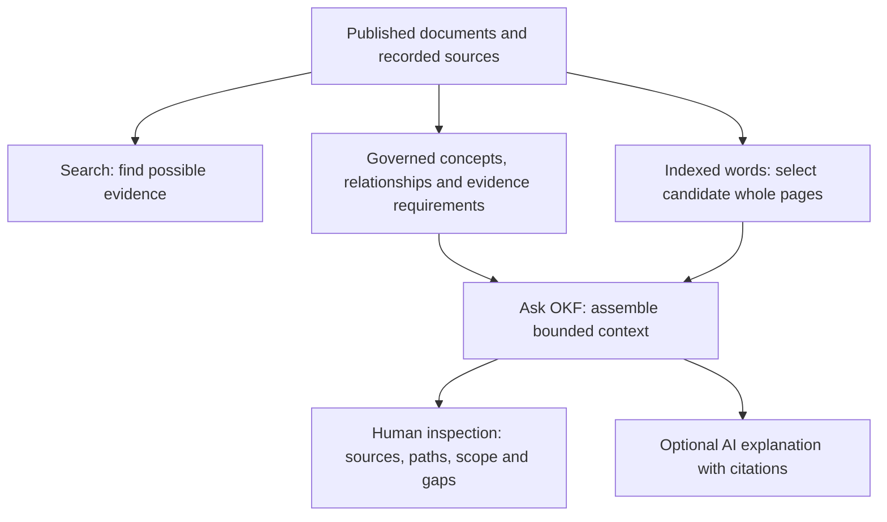

# Learn OKF-DWP by using it

[What changed](../CHANGELOG.md) · [Work in progress](work-log-2026-09-19.md) · [Remaining work](backlog.md)

OKF-DWP is an independent experiment in making published benefits guidance easier
to find, connect and inspect. It is not a DWP service, an entitlement decision or
a benefits calculator. You do not need to understand the technology before
trying it.

Follow the stages in order, or start with the task you need. Each stage explains
new terms when they become useful. The [glossary](glossary.md) is a reference to
return to, not required reading first.

The [retrospective](retrospective.md) explains what this experiment established.
The [methodology](methodology.md) shows how another department can begin with
source, terminology, legal and ontology discovery before building its own bundle.

## 1. Find out what is in the collection

Imagine you are preparing a briefing about someone going abroad. You need to
find guidance, establish which benefits it covers and notice missing facts.

The Department for Work and Pensions ([DWP](glossary.md#dwp-dmg-and-adm)) publishes
the Decision makers’ guide (DMG) for its staff. This project captured the declared
full-DMG collection on 15 September 2026: **331 PDF documents and 14,743 measured
pages**. PDF means a document format that preserves page layout. The originals
and machine-extracted page text are retained. Extraction can lose text, tables or
reading order, so the original page remains important. See the
[DMG acquisition record](next-stage/full-dmg-acquisition.md).

The separate ADM manual was acquired on 19 September: **182 PDFs and 4,347
measured pages**. Together the manuals contain **513 PDFs and 19,090 pages**,
including 18,197 pages with nonempty extracted text and 893 with no extracted
text. A page with no extracted text still has its original PDF link; a nonempty
extraction can still contain errors. See the [ADM acquisition guide](adm-acquisition.md).

A **[snapshot](glossary.md#snapshot-version-and-hash)** is a saved version of that
collection. “Full capture” refers to this dated collection, including historical
material. It does not mean every rule has been interpreted or that all current
benefits law is represented. Advice for decision making (ADM) is a separate
guidance family. DWP directs some benefit decisions to ADM rather than DMG; see
the [official explanation](https://www.gov.uk/government/publications/decision-makers-guide-vol-1-decision-making-and-appeals-staff-guide).

**Try:** open the [full-DMG walkthrough](full-dmg-walkthrough.md). Find a chapter
and open its original PDF. Notice the difference between a source document and
the project's interpretation of it.

## 2. Use Search to find a starting point

Search answers **“Where might relevant knowledge be?”** It returns matching
records. A record might describe a document, a page, a term or a proposed
relationship. Finding a page does not establish a complete answer.

For example, “benefits abroad” leaves several questions open: which benefit,
which country, temporary absence or permanent move, and which date? These are
questions about **[scope](glossary.md#scope-and-applicability)** — the limits of
what a statement covers.

**Try:** search for `imprisonment` using the
[Ask OKF demonstration](context-assembly-demo.md). Open a result and follow its
source link. Then consider whether a hospital-admission question needs different
evidence, even if the same benefit names occur in both questions.

**Learn when needed:** [benefit names and variants](glossary.md#benefit-names).
Pension Credit and State Pension are separate benefits. “ESA” alone may be too
broad: different Employment and Support Allowance variants need different
guidance.

## 3. Use Ask OKF to assemble evidence

Ask OKF answers **“What evidence does this bundle provide for this task?”**
It identifies recognised concepts, follows declared relationships and collects
evidence within an explicit size limit. It shows why each item was included.

A **[concept](glossary.md#concept-ontology-and-graph)** is a named idea, such as
imprisonment. A **relationship** connects records, for example a guidance page
referencing a benefit-specific chapter. Together these records and connections
form a graph. You can inspect the connections rather than trusting a hidden
selection process.

The **[context package](glossary.md#context-package-profile-and-budget)** is the
machine-readable result: selected records, source references, relationships,
scope, reasons and gaps. An evidence **profile** declares what evidence is
required for a supported task. It is more than a list of documents.

### Choose the version being demonstrated

The new full-corpus candidate uses version
`bf50ef8d91b9f1ccc2cbdb354198eae74c9ed752` and the additive
`full-dmg/okf-corpus-context.json` descriptor. Its
[five-minute walkthrough](remote-mcp-demo.md#five-minute-full-corpus-presentation)
starts with a staff question and inspects whole pages from both manuals. The
43-case remote evaluation and [three live SDK cases](remote-mcp-demo.md#live-sdk-verification-19-september)
are recorded. ChatGPT inspected a bounded abroad package. The published Explorer
and native browser tools also returned the same complete bounded package in the
[recorded public check](remote-mcp-demo.md#published-explorer-and-native-webmcp).
The broad corpus does not yet have complete
task-specific evidence profiles, so candidate evidence remains `insufficient`.

The preserved baseline at version `efb05c66616a9cd4328a86cf412780fe7bc7cf0b` has
**52 Ask context records focused on imprisonment and legal custody**. The wider
DMG collection is available for discovery, and the separately acquired ADM
manual supplies further source pages. This particular Ask profile does not cover
the whole collection. The [staff-question registry](../evaluation/staff-questions/cases.json)
contains **40 question occurrences, with 39 distinct wordings**, to test broader
needs against that baseline. A later profile requires its own version and
evaluation; it must not silently change what this baseline proved.

The newer combined-corpus path can select whole pages from the nonempty DMG and
ADM text. Its remote evaluation is recorded; transport, browser and actual
AI-client acceptance have separate evidence. It ranks the words in the question, while concept
resolution separately uses declared aliases. Existing aliases and relationships
retain their original scopes: a custody-specific concept is not a complete model
of every benefit. A matching page can be a useful starting point without proving
that a rule applies to the question.

**Try:** use the full-corpus walkthrough with “What happens to your benefits if
you go abroad?”, set **Package bytes** to **32768**, and inspect the six source
pages and missing facts. That budget matches the recorded ChatGPT and browser-tool
comparison. To compare with
the original imprisonment acceptance case, explicitly open the preserved custody
version. That version has a bounded imprisonment profile and lacks a hospital
evidence profile. The [historical hospital review](remote-mcp-hospital-coverage.md)
explains that gap; it is not a claim that the wider corpus has no hospital text.

## 4. Read the result before asking an AI to explain it

Ask OKF and an AI answer have different jobs. Ask OKF selects inspectable evidence.
An AI may then explain that evidence. Its explanation needs citations and must
preserve the package's limits.

| What you see | What to check |
| --- | --- |
| `sufficient` | Sufficient for the declared evidence requirements and scope; this is not a legal decision or specialist approval. |
| `insufficient` | Identify missing evidence, unresolved wording or budget limits. Do not complete the answer from guesswork. |
| `conflicting` | Inspect the conflicting evidence and its scope; do not silently choose a preferred result. |
| Source extract | Follow the original document link and page locator. Machine extraction remains unreviewed. |
| Authored concept or relationship | Check who or what proposed it and what supports it. A model-authored term is not an official passage. |

Reporting a gap is called **[failing closed](glossary.md#fail-closed)**: the system
withholds a completeness claim when it cannot establish the required evidence.
The staff-question baseline tests this behaviour. Passing that test is useful,
but is not the same as answering the benefits question.

**Learn when needed:** [provenance and authority](glossary.md#provenance-and-authority),
[entitlement and payment](glossary.md#entitlement-payment-and-disqualification).
Keep publication dates, capture dates and legal effective dates separate. A
September capture does not turn an April publication into a September edition.

## 5. Connect an AI to the same evidence

**[MCP](glossary.md#api-mcp-and-webmcp)** is a protocol through which an AI client
can discover and call a service's tools. The remote Ask OKF tool is `ask_okf`.
It reads an approved, pinned bundle; it does not write claimant records or search
arbitrary websites.

For the tested ChatGPT setup, follow the [connection instructions](remote-mcp-demo.md#connect-chatgpt):
enable Developer mode where available, create or select the Ask OKF connection,
and use `https://ask-okf.crpage.chatgpt.site/okf/mcp` with no authentication.
The [official OpenAI guide](https://developers.openai.com/plugins/deploy/connect-chatgpt)
describes the connection flow; availability depends on the account and workspace.

Pasting that endpoint into a normal browser sends a **GET** request and can show
**405 Method Not Allowed**. The tool client uses **POST** requests. A 405 for that
browser visit does not mean the service has failed. The
[service information page](https://ask-okf.crpage.chatgpt.site/) is for ordinary
browser visits. See [HTTP and 405](glossary.md#http-get-post-and-405).

**WebMCP** exposes tools through a supporting browser page. Remote MCP connects
to a service. Neither one proves that a particular AI client can use the other.
In the published Explorer, the Codex in-app browser actually called the context
build and explain tools. At the same version, question and 32,768-byte budget,
their complete package matched Explorer's UI and the remote MCP result: six
source pages and 31,312 bytes, still insufficient and truncated.
Text calls were tested in ChatGPT; **Ask OKF invocation through ChatGPT Voice has
not been verified**. Rehearse the intended account and audio equipment separately.

There are also two size limits. Ask OKF can deliberately omit items to meet a
**budget**, and reports that omission. An AI host can separately cut down the
received tool output. In the recorded ChatGPT tests, a complete service response
did not always remain completely accessible to the model. Use the
[tested full-corpus prompt](remote-mcp-demo.md#full-corpus-chatgpt-rehearsal-prompt)
and keep its insufficient status and truncation visible. Earlier custody-version
observations remain separately labelled.

## 6. Decide what an evaluation actually proves

An **[evaluation](glossary.md#evaluation-ci-branch-and-pull-request)** is a defined
test with evidence requirements. This project separates source coverage,
semantic coverage, discovery, traversal, assembly, provenance, boundaries and
answerability. A phrase appearing in a result is not an adequate success test.

Ask four questions of a result:

1. Was the relevant source acquired, and can I open its exact page?
2. Are the required concepts, qualifications and relationships represented?
3. Did the tool return the correct evidence, with its scope and gaps intact?
4. Could the receiving AI inspect it and produce a supported explanation?

Those are separate checks. The [staff-question registry](../evaluation/staff-questions/cases.json)
keeps ambiguous wording visible, including “SDA” and the War Pensions question.
Source candidates are research starting points, not complete answers. Existing
model answer trials and new transport checks should not be combined into one
unqualified success percentage.

The questions cover travel abroad, State Pension, Pension Credit, Industrial
Injuries Benefits, Personal Independence Payment and Carer’s Allowance. Use them
to identify missing evidence and design specialist review, rather than asking
learners to memorise benefit acronyms. Follow the [benefit glossary](glossary.md#benefit-names)
when a new name appears.

The [recorded remote baseline run](../validation/staff-questions/receipt.json) on
19 September 2026 returned `insufficient` for all 40 occurrences. All 40 complete
packages matched the shared Explorer engine, with no assembly-budget truncation;
42 source candidates were verified separately. That establishes repeatable gap
reporting and source traceability. It leaves substantive answerability open.
ChatGPT's handling of tool output has its [separate observed tests](remote-mcp-demo.md#actual-chatgpt-pro-observation-19-september).

The [full-corpus remote run](../validation/corpus-questions/receipt.json)
uses those same 40 questions plus three boundary controls. All 40 staff questions
return candidate evidence, including ADM pages. Twelve packages retain an
independently located candidate page; 21 retain a page from a candidate PDF.
This measures retrieval against known research starting points. It does not
score answers or establish that every selected page is relevant.

All 43 results remain `insufficient`; none produces an AI answer or has specialist
acceptance. The broad questions lack complete task-specific evidence profiles.
The whole-page candidate limit can omit other matches, and the package reports
that truncation. All 43 complete remote packages match the shared engine.
Published-browser and actual ChatGPT checks have separate evidence. Three live
SDK checks have separately confirmed exact engine agreement for current
imprisonment and hospital queries and the explicitly selected historical
imprisonment profile.

The [published-browser check](remote-mcp-demo.md#published-explorer-and-native-webmcp)
also showed the default imprisonment task's eight resolved concepts, 64 records
and 127 relationships, including visible routes to chapters 24, 53, 54 and 78.
The 516,146-byte package remained insufficient and truncated. Visible routing
helps inspection; it does not itself establish complete legal coverage.

The [actual full-corpus ChatGPT rehearsal](remote-mcp-demo.md#actual-full-corpus-chatgpt-observation)
first exposed irrelevant page selection. A general filter for ordinary question
wording was corrected; the same bounded question then returned six source pages
about international issues. ChatGPT inspected those pages without reporting host
truncation and kept the result insufficient. The repeat staff-question run changed
the known-page overlap from 10 to 12 cases and document overlap from 19 to 21.
That is a measured retrieval improvement, not a complete benefits answer or an
answer-quality score.
See the [before-and-after results and Monday steps](../evaluation/staff-questions/results.md)
for a concise demonstration sequence.

Smaller packages might eventually reduce AI input, but bytes are not
**[tokens](glossary.md#llm-rag-and-token)** and fewer bytes do not prove lower cost
or equal answer quality. Those claims need a separate measured comparison.

## 7. Explore how the bundle is built

An **[OKF+ bundle](glossary.md#okf-and-okf-plus)** packages knowledge with explicit
structure, sources and additional semantic contracts. Authors use **YAML-LD**;
build tools produce the formats consumed by Explorer. **JSON-LD** and **RDF**
provide ways of expressing linked data. You can learn these formats after you
have inspected a useful example; see the [format glossary](glossary.md#yaml-ld-json-ld-and-rdf)
and [semantic contract](next-stage/semantic-contract.md).

For a contribution, use a **branch** to prepare changes and a **pull request** to
review them. Automated **CI** checks run before merging. The
[governance guide](repository-governance.md) explains the actual required checks
and private-input protections. Passing structural checks establishes neither
legal correctness nor specialist acceptance.

Return to the [project overview](../README.md), the [glossary](glossary.md) or the
[presentation script](remote-mcp-demo.md) according to your next task.
