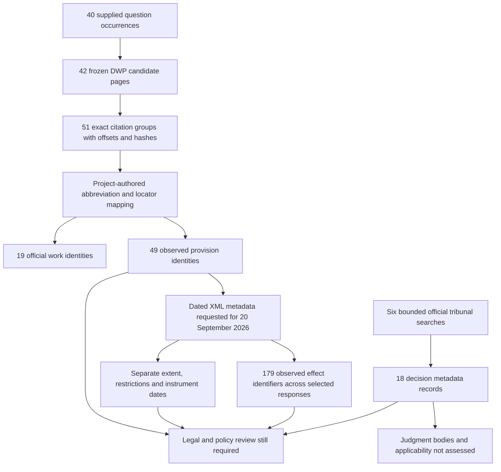

# Legal reference reconciliation

**20 September 2026. Independent research, not official DWP guidance or a legal
answer key.** This increment supplies checkable legal references for the supplied
staff questions. It does not determine an individual's entitlement or calculate
an award.

## Start with the question, then follow its sources

The [staff registry](../evaluation/staff-questions/cases.json) contains 40 question
occurrences and 42 shared candidate pages. A *candidate* is a page worth checking;
its presence does not establish a complete answer.

The [citation census](../evaluation/legal-reconciliation/citations.json) accounts
for every one of those 42 pages and preserves each question's case identifier.
It detects 51 indented citation groups on 26 pages. Each group retains the exact
text, page offsets and source hashes. The remaining 16 pages say that no candidate
was detected; they do not claim to have no legal dependencies. For example, a
footnote can continue on the next page or be damaged during PDF extraction.

An *instrument* is an Act or set of regulations. A *provision* is a particular
section, regulation or schedule within it. An official *identifier* names that
item; a dated document address names the representation requested for a date.
Neither an identifier nor a successful download proves how a provision applies
to a particular person.



The diagram shows the actual delivery, rather than an approved legal reasoning
chain. An *effect* is a source-recorded change to legislation; effects metadata
can concern other provisions in the same Act. It is not automatically a change
to the provision being inspected.

## What has been checked

The [coverage report](../evaluation/legal-reconciliation/coverage.json) is
generated from the source receipts and the unchanged staff registry.

| Check | Recorded result | Boundary |
| --- | --- | --- |
| Staff coverage | All 40 occurrences, including the repeated question, remain linked to their candidates | No candidate set is declared a complete answer |
| Work selection | 19 instrument identities selected from literal citations | The abbreviation mapping is a project-authored proposal |
| Provision requests | 49 official dated XML requests; all 49 returned the requested identifier | Top-level identifiers verified; subordinate and inherited locators still need review |
| Extent | 29 responses carry extent attributes on the target or an ancestor; 20 do not | Attributes are retained at their original level; absent extent is unknown |
| Effects | 179 distinct source effect identifiers, carried in 21 selected responses | This is not a complete effects or amendment census |
| Tribunal discovery | Six queries; three results per query; 18 distinct decision metadata records | Every query was truncated; no judgment body or applicability determination |
| Legal acceptance | Zero accepted legal propositions | Specialist acceptance remains pending |

The [official metadata snapshot](../source/legal-discovery-2026-09-20/manifest.json)
retains request addresses, observation times, response hashes, selected identifiers
and source-supplied attributes. Metadata files have separate hashes checked
offline. Response bodies were parsed but are **not retained**: neither statutory
body text nor judgment body text is published in this increment. A response hash
therefore records the acquisition observation; it does not enable offline
reconstruction of the original response. A refresh must produce a separately
named snapshot and must not overwrite this evidence.

Source rights are recorded separately from the project's original material.
Official legislation metadata points to the [legislation copyright guidance](https://www.legislation.gov.uk/information/copyright)
and the Open Government Licence with its exceptions. Tribunal records retain the
GOV.UK metadata boundary; rights to reuse judgment bodies have not been assessed.

## Date and territory checks matter

For example, the acquired [State Pension Credit regulation 3 metadata](../source/legal-discovery-2026-09-20/legislation/uksi--2002--1792--regulation--3.json)
records a dated provision address for 20 September 2026. Its containing work has
a `RestrictStartDate` of 16 July 2026. That is a source restriction on the work;
the producer does not transfer it into a commencement date for regulation 3 or
substitute it for the source capture date. The earlier legislation integration
assessment retains its older catalogue observation unchanged.

The [Pensions Act 1995 schedule 4 metadata](../source/legal-discovery-2026-09-20/legislation/ukpga--1995--26--schedule--4.json)
illustrates why retaining levels matters: the schedule carries `E+W+S`, while
the Act carries `E+W+S+N.I.`. These are literal source extent codes. They mean
England, Wales and Scotland, with Northern Ireland additionally present at Act
level. The wider Act code must not silently replace the schedule's code or be
treated as a decision about a claimant's case.

Instrument enactment/made dates, XML restriction dates, requested version dates,
tribunal decision dates, publication dates and acquisition times stay separate.
Commencement, transitional arrangements, outstanding amendments and legal
applicability remain explicit review tasks.

## What remains unresolved

- Citation detection is deliberately bounded. Split or unindented footnotes,
  unknown abbreviations, reported case citations and neighbouring pages can
  contain further dependencies.
- The producer resolves only explicit top-level locators for selected instruments.
  It preserves the complete literal while marking subsections, inherited
  references and unacquired targets unresolved. It does not guess a missing
  provision from a similar name. A named unknown instrument ends the preceding
  instrument's scope. Independent review caught and corrected an earlier parser
  error that carried a Child Benefit citation into the preceding DLA regulation;
  regression controls now preserve this boundary. The final projection contains
  81 literal reference occurrences, including repeated citations.
- The capital candidate `source-c031` contains the literal `SPC Regs, s 5 &
  s 12(2)(d)`. It remains uncorrected and unresolved at that locator. The project
  must not silently reinterpret a source citation that may contain a typographical
  or extraction problem.
- Official source metadata is evidence of an observed identity, date or attribute.
  It does not supply statutory text to an AI, reconcile an entire amendment chain
  or prove current application of the captured DMG guidance.
- Tribunal hits are discovery references. Their precedential weight, later
  history, facts and application to the staff questions need judgment acquisition
  within an assessed rights boundary and legal review.

These are different states. A known official identifier is not a missing source;
a missing statutory body or unreviewed applicability is not repaired merely by
having that identifier.

## Bounded tribunal discovery

The six quoted queries were `"pension credit"`, `"state pension"`, `"carer's
allowance"`, `"personal independence payment"`, `"industrial injuries"` and
`"abroad"`. They were submitted to the official GOV.UK search API, filtered to
`utaac_decision`, with `count=3`, `start=0` and the API's default relevance order.
The [actual query receipts](../source/legal-discovery-2026-09-20/queries.json)
record totals of 79, 103, 69, 379, 53 and 104 respectively. These totals overlap
and must not be summed into a corpus size.

The [decision register](../evaluation/legal-reconciliation/tribunal-discovery.json)
retains title/neutral citation, official content identifier, attachment case
identifier, chamber, source categories, judges, decision date, publication date,
rights boundary and exact official links. A complete census of **these six
requests** is not a complete census of tribunal decisions.

No edge declares that a decision governs a benefit or applies to a question
because its words matched a search. The existing
[official decisions finder](https://www.gov.uk/administrative-appeals-tribunal-decisions)
remains the starting point for a wider legal research exercise.

## Reproduce and review

Ordinary build and validation are offline:

```sh
uv run --locked python scripts/build_legal_reconciliation.py
uv run --locked python scripts/build_legal_reconciliation.py --check
uv run --locked python -m unittest discover -s scripts -p test_legal_reconciliation.py
```

Authoring and generated references are additive under
[`domain-profile/legal-reconciliation`](../domain-profile/legal-reconciliation/seeds.json).
The [reference assertions](../evaluation/legal-reconciliation/assertions.json)
use `dcterms:references`: they are navigation proposals backed by literal
citations and verified target identities. They do not use `owl:sameAs`,
`governedBy` or an inferred applicability predicate. The frozen Pension Credit
pilot, full DMG and ADM acquisitions are not rewritten.

The acquisition command is explicitly separate:
`uv run --locked python scripts/acquire_legal_reconciliation.py --acquire`.
It refuses to overwrite the dated snapshot. A future refresh needs a new dated
destination and a reviewed comparison before any published binding changes.

For Monday, open a staff evidence pack, follow its `source-c…` entry in the
citation census, inspect the exact footnote and then open its official dated
provision. Show the recorded unknowns alongside the link. This demonstrates
checkable source reconciliation; it does not present a complete legal answer.

## Publication projection and identifier verification

The source website uses opaque effect identifiers whose literal shape triggered GitHub credential protection. All 179 were independently observed through 14 unauthenticated official XML reads as legislation `Effect` or `UnappliedEffect` attributes. The [machine receipt](../source/legal-discovery-2026-09-20/effect-identifier-verification.json) preserves digest comparisons, source URLs, response hashes and element positions. This establishes the public source of the flagged values; it does not establish the legal applicability of any effect.

The unused literal effect identifiers and associated URLs are omitted from the public metadata. Their SHA-256 digests, ordering, substantive amendment attributes and original acquisition receipts remain. [The projection ledger](../source/legal-discovery-2026-09-20/publication-projection.json) records the deliberate information loss and old/new file hashes. Provision identities, quoted DWP citations, dates and territorial metadata are unchanged. No credential-protection bypass was used.

Changing these metadata bytes changes the current semantic snapshot because its provenance is bound to source bytes. Previously recorded model trials remain historical evidence: their exact input index, packages and receipts are retained and are not regenerated against the revised projection. See [trial replay](staff-model-trials.md).
