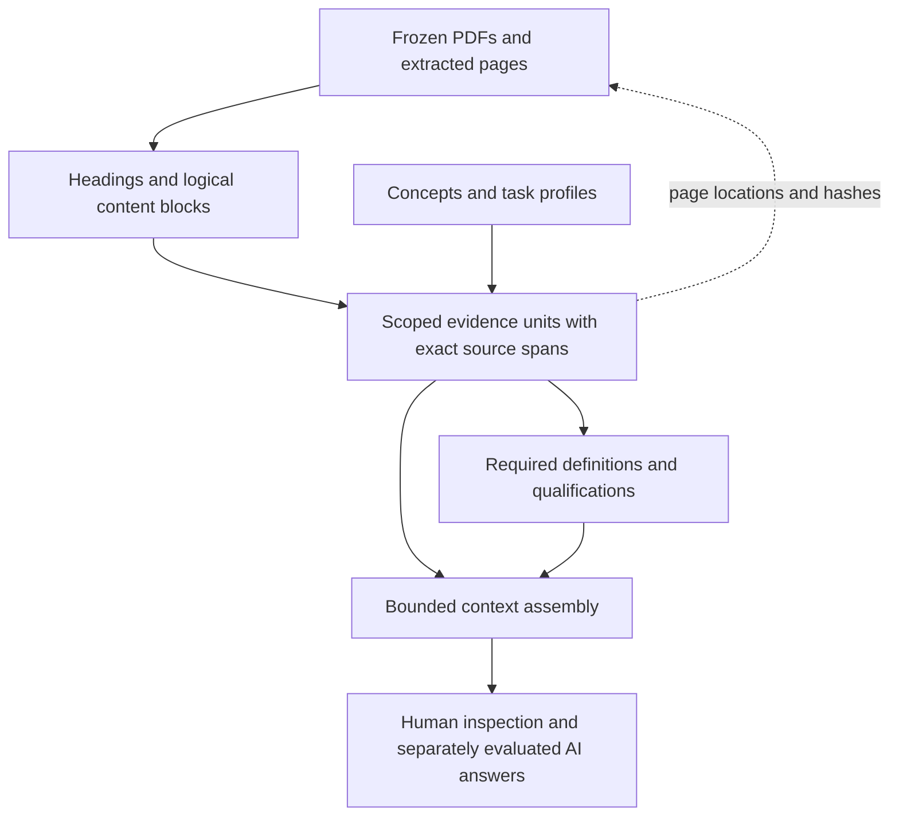

# Logical evidence units

[Learning path](learning-path.md) · [Backlog](backlog.md) · [Earlier abroad review](abroad-semantic-audit.md)

**Implemented and verified in the public Reader, 22 September 2026.** This is an independent research
publication, not an official DWP service or an entitlement decision.

## Why a page is not enough

A PDF page tells us where text appears. It can stop in the middle of an example,
condition or citation. It can also contain several unrelated rules. The source
pages remain the immutable record of what was captured; they are not sufficient
boundaries for retrieving meaning.

The intended **logical evidence unit** is a complete source passage with its
governing heading, list, notes, citations and attached examples. It can cross
several pages. Automatically detected candidates remain explicitly uncertain
until their boundaries have been reviewed. A separate **dependency** names other evidence needed to interpret it,
such as a definition, exception or update memo. An example needs its parent rule;
finding its concluding sentence does not establish a general rule.



## Source integrity and uncertainty

Each unit records ordered source spans, explicit UTF-8 byte offsets, source and
fragment hashes, and any inserted joining characters. A **hash** identifies
exact bytes. The producer checks the original extraction; the consumer checks
the supplied unit and its internal span consistency. Consumer checks do not
re-acquire the PDF or prove that a machine extraction reproduced its layout.

Detected boundaries remain labelled as machine candidates. Explicit authored
boundaries have source-backed reasons and an agent-review status; neither is
specialist acceptance. Contents, reserved paragraph ranges, empty extraction,
ambiguous headings and unassigned material remain accounted for. Repeated
paragraph numbers need document, version and occurrence context.

Segmentation and semantic modelling are separate. A smaller complete passage
does not automatically acquire a benefit concept, a task route or current legal
applicability. Old page-based requirements and frozen evaluations retain their
original identities. New unit-based requirements need their own reviewed scope.

## What is implemented

The new additive projection covers both frozen manuals: **DMG**, the Decision
makers’ guide, and **ADM**, Advice for decision making. These manuals concern
different benefits and variants; being in the same corpus does not make their
rules interchangeable.

| Measure | Recorded result |
| --- | ---: |
| Frozen source documents / PDF pages | 513 / 19,090 |
| Pages with no extracted text | 893 |
| Logical unit records | 49,680 |
| Cross-page units | 12,471 |
| Source bytes accounted / unassigned | 35,143,443 / 0 |
| Explicitly authored unit boundaries | 46 in six documents |
| Cross-page authored excerpts | 18 |
| Remaining uncertain machine candidates | 49,634 |
| New scoped task profiles / relationship proposals | 5 / 28 |
| Explicitly unresolved references | 8 |

A **task profile** declares which concepts activate a question scope and which
source paths it needs. It is authored knowledge, not an instruction that the
retriever may use as a hidden answer key. The new profiles cover Pension Credit
absence, Universal Credit temporary absence, household absence, temporary
care-home residence and temporary/permanent care-home alternatives. Earlier page-based
profiles remain in their original projection; they have not all been migrated.

The Reader contains 50,524 records: the units, 331 concepts and 513 source
documents. It shares one PDF resource per document, retains exact page links on
each unit, and offers boundary, unit-kind, manual and authored-concept facets.
The 523 graph relationships include existing concept relationships and the new
source routes. A facet saying **No authored reference** exposes a semantic gap;
it is not evidence that the source contains no relevant meaning.

## The page-break example

The authored unit for DMG 077001 joins the end of PDF page 8 to its continuation
on page 9. It retains both complete Jason and Nicola examples, the continuing
entitlement conditions, duration branches, citations and the reference to DMG
04642. Other units retain the death-related and medical branches and the
qualified-practitioner definition, including its citation on the following page.
The unresolved supersession reference stays visible. Household and
qualifying-young-person passages have separate, conditional scope.

ADM source fixtures retain the Universal Credit absence passages, their
cross-page qualifications and an unresolved memo reference. **Boundary review by an agent is not
specialist legal acceptance**, and the memo’s applicability remains unresolved.

## Recorded comparison

[Machine-readable results](../evaluation/logical-units/run/summary.json) compare
40 staff questions, five focused cases and one unknown-term control in both
modes at 32 KiB and 512 KiB: **184 assemblies**, plus seven scope controls. KiB
means 1,024 bytes. The run used the same frozen sources and questions, no network
and no model calls. Its exact evaluator and engine hashes are retained alongside
20 focused context archives.

At 512 KiB, the new focused profiles retained these declared paths:

| Focused case | Paths retained / required |
| --- | ---: |
| Pension Credit abroad | 6 / 6 |
| Universal Credit temporary absence | 4 / 4 |
| Pension Credit household absence | 8 / 8 |
| Pension Credit temporary care home | 2 / 2 |
| Pension Credit permanent care home | 4 / 4 |

These **24 paths are not the old page-profile denominator**, and do not close
203 previously recorded review obligations. All 184 results remain
`insufficient`, with `ai_answer: null`. At 32 KiB all five focused unit packages
retain **zero source evidence**: metadata and required context cannot fit. The
small-budget refusal is a limitation, not a successful benefits answer.

Local median assembly time was 176.64 ms for units and 126.17 ms for pages at
512 KiB across all 46 cases. This includes confined local reads and cache reuse,
not remote delivery or client latency. Unit packages retained more source text
in these focused cases, including uncertain lexical candidates. This is **not a
performance improvement, relevance score or model-answer accuracy result**.

## Demonstration and reproduction

The additive Reader descriptor is `logical-context/okf-explorer.json`; its Ask
index is `logical-context/manifest.json`.
[Open the pinned logical-unit Reader](https://chris-page-gov.github.io/okf-explorer/explore/?bundle=https%3A%2F%2Fraw.githubusercontent.com%2Fchris-page-gov%2Fokf-dwp%2Fadfa7137d3b24033d7265123c739a9ffcfb06584%2Flogical-context%2Fokf-explorer.json#overview)
with the compatible Explorer build from
[PR 140](https://github.com/chris-page-gov/okf-explorer/pull/140).
The source pin identifies unchanged logical data from this implementation;
the [public browser and WebMCP observation](../validation/logical-context/public-adfa7137/browser-observation.json)
verifies this pinned source with Explorer commit `69d38b1c`. UI, JSON and actual
WebMCP build/explain calls agree on the context ID; no public console warnings
or errors were recorded. Exact merged CI and documentation deployment status
remain in the [DWP PR handover](https://github.com/chris-page-gov/okf-dwp/pull/28). The existing combined Reader and remote
service keep their separately recorded versions. Do not describe this build as
a new default deployment of `ask-okf.crpage.chatgpt.site`.

1. Open the logical-unit descriptor in Explorer.
2. Search **077001**. Compare the contents candidate with the authored gateway
   unit; open the whole passage and its exact source spans.
3. Select **Ask OKF** and ask: **What happens to Pension Credit if I go abroad?**
4. Under **Evidence limits**, use **524288 package bytes**. Build the package.
5. Show resolved concepts, the gateway and complete examples, directed
   `references` and `requires` relationships, provenance and missing obligations.
6. Inspect or copy the package JSON. A compatible WebMCP host can call
   `okf_build_context` and `okf_explain_context` and compare the same context ID.
7. Repeat at **32768 bytes** to demonstrate an explicit insufficient-context
   refusal. Do not fill the gap with a model’s own knowledge.

```sh
uv sync --locked
uv run --locked python scripts/build_logical_units.py --check
uv run --locked python scripts/build_logical_context.py --check
uv run --locked python -m unittest discover -s scripts -p 'test_logical*.py'
node --experimental-strip-types scripts/evaluate_logical_context.mjs --check --explorer-root /path/to/approved/okf-explorer
```

The approved immutable engine and four module hashes are in
[engine.json](../evaluation/logical-units/engine.json). Check out that commit
before the final command. The check verifies those Git blobs before importing
code, recomputes bounded packages and compares the retained results. It does not
call an AI provider or overwrite earlier observations.

## What remains open

- Review the other 49,634 machine boundaries and difficult layout, table and
  heading cases. Full byte accounting proves preservation, not correct meaning.
- Migrate the remaining staff profiles with explicit concept and qualification
  routes. This increment supplies five scoped profiles, not full semantic
  coverage of the 40 staff questions or every DMG/ADM benefit.
- Resolve the eight references, current legal versions, territorial and
  claimant applicability, and obtain specialist review.
- Reduce unrelated lexical candidates and metadata overhead; prove useful
  compact delivery before adopting a new remote-service source version.
- Run new paired fixed-evidence model trials only after evidence scope review.
  No claim of improved answers or affordability follows from this build.

These are tracked separately from the completed implementation packages in the
[backlog](backlog-work-packages.md). Earlier failed integrations and preliminary
comparisons remain in the [work log](logical-units-work-log.md).

## Acceptance gates

1. Reconstruct exact unit fragments from the frozen source; retain every original
   span or explicitly classify why it is not a logical evidence candidate.
2. Preserve complete conditions, examples, footnotes, tables and heading scope.
3. Keep source references distinct from required support and applicability.
4. Load required unit destinations within explicit resource bounds and name any
   missing or ambiguous dependency.
5. Compare identical questions, source and budgets; report required support,
   irrelevant text, metadata cost, truncation and unresolved concepts separately.
6. Preserve old page routes, immutable sources, service versions and replay
   receipts. Admit a new service version only after its own checks pass.
7. Keep the beginner guide, machine backlog, changelog and publication status in
   step with the actual implementation and observed results.
