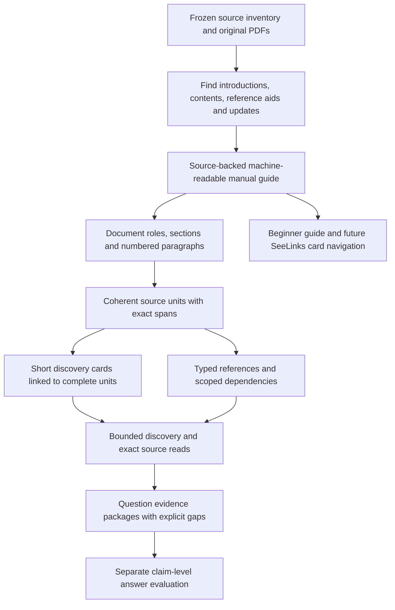

# Build from the manual's own structure

**Status: implemented; integrated context and publication checks in progress, 23 September 2026.** This is an independent
research process, not official DWP guidance or specialist acceptance.

## Goal and scope

Process the complete captured Decision makers' guide (DMG) and Advice for
decision making (ADM) collections using their own organisation and conventions.
The starting release is `908adc45a4e22eb72ed13fe8943877307b732850`: 513 PDF
documents, 19,090 source pages and 40 recorded staff question occurrences.
Historical amendments, references, memos and empty extractions remain in scope
with their existing roles. A complete census is not complete legal knowledge.

The build must first discover how a document is intended to be read. Introductory
chapters, contents, abbreviation lists, legal-reference lists and update notices
are inputs to that discovery. The resulting **manual guide** is machine-readable
and has a human-readable explanation. Each supported convention points to its
frozen evidence. Where a convention or passage boundary cannot be established,
the build records the uncertainty rather than supplying an invented rule.

## Production sequence

1. **Discover the reading conventions.** Identify which manual, benefit regime,
   document role and version are involved. Record numbering and reference syntax,
   contents structures, examples, notes, lists, tables, footnotes and updates.
2. **Recover the logical structure.** Separate contents entries from governing
   headings. Check paragraph-range containment. Keep examples, continuations and
   citations attached to their source passage across page breaks. Source pages
   remain locations, not the default unit of meaning.
3. **Describe passages for discovery.** A card states the principal subject,
   structural role, source identity, scope and known qualifications. Literal or
   deterministic descriptions and model-derived summaries have different status.
   Incidental mentions do not become benefit applicability.
4. **Represent relationships explicitly.** Separate structural containment,
   source cross-references, interpretation dependencies and learning prerequisites.
   A printed reference is evidence of a reference; it does not automatically prove
   that its destination is a necessary legal condition. Reserved or ambiguous
   destinations stay unresolved.
5. **Assemble and inspect evidence.** Discover cards and literal text, then read
   the exact complete units and admitted supporting material. Preserve manifests,
   bounded reads and replay identities. A card cannot substitute for omitted
   source text or satisfy a completeness requirement merely by summarising it.
6. **Evaluate all staff questions.** Retain the original wording and duplicate
   occurrences. Report source coverage, relevance, scope, source retention,
   relationship paths, outstanding obligations and supported claims separately.

## Smallest useful experiment, then double

Use one candidate process compared with the frozen baseline. Avoid several
simultaneous tuning arms. The independent evaluation owner freezes source-bound
expectations before implementation results are inspected.

- **First gate: four structural cases.** Two known governing-heading failures,
  plus a complete cross-page passage from each manual, cover the immediate
  failure mechanisms without a question-specific retrieval patch.
- **Second gate: eight cases.** Repeat the same checks after the first gate
  passes, adding different documents and structural roles. Freeze membership and
  expected source evidence before the first run. Report these as development
  acceptance cases, not a blind estimate of corpus-wide accuracy.
- **Corpus gate:** account for every captured document, page and extracted byte,
  then evaluate all 40 staff question occurrences. This full census is separate
  from the doubled structural experiment.

The protocol and exact expectations live in `evaluation/manual-structure/`.
Failure is retained with its producer and input identities. A changed candidate
must rerun both affected and preceding gates. A success means that the specified
checks pass; it does not upgrade machine interpretation to official authority.

The later question comparison must include relevant passage discovery, retained
conditions and exceptions, unresolved scope, payload and measured execution time.
Earlier candidate locations are review leads, not a complete answer key. Any
answer trial must retain the exact supplied evidence and assess individual
claims separately from retrieval. No answer-quality or affordability result is
assumed in advance.

## Preservation and publication

- Build additive projections from authored inputs; do not hand-edit generated
  records or rewrite previous source, replay or trial snapshots.
- Preserve source hashes, ordered spans, version roles and old obligation IDs.
- Keep private correspondence and assessor material outside Git and publication.
- Use confined local reads and locked dependencies. Source instructions remain
  inert data. No source can grant execution or acquisition permission.
- Use isolated feature branches, independent review, normal protected PR merges,
  exact merged CI and public verification. Record designed, implemented, tested,
  merged and publicly observed states separately.
- While one owner watches publication, other workers advance independent tasks
  in separate files or worktrees. Freeze the release under test, not the project.

## Completion report

The report must account for all 513 captured documents and all 40 staff question
occurrences, including unsupported structures and unresolved questions. It must
identify which improvements are live in Explorer and which exist only in an
experimental projection. Full legal answerability, specialist approval, current
law and perfect segmentation are not outcomes that an unattended build can
declare merely because processing finished.

The future **flip the card / SeeLinks** interaction can expose a card's complete
source, surrounding section, definitions, exceptions, references, prerequisites
and provenance. This phase supplies those inspectable relationships; a new
visual card interaction has its own implementation and acceptance boundary.
