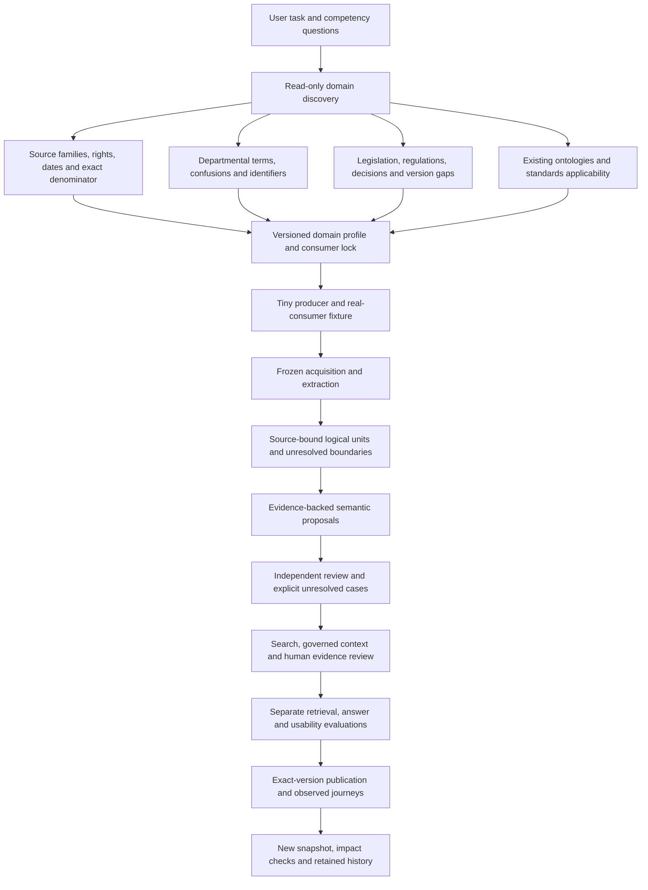

# A portable, discovery-first OKF method

**Purpose:** repeat the useful parts of this exemplar for another department,
without copying its benefit concepts, legal assumptions or incomplete coverage.
This is a method, not evidence that an HMRC bundle has been built.

Start with a real question and the words the department uses. Discover sources,
standards, terminology, legislation and existing ontologies **before generating
semantic assertions**. A complete download is one input to this work, not its
conclusion. The [retrospective](retrospective.md) explains what the DWP work
actually established; [ontology use](ontology-use.md) identifies the vocabulary
implemented here.

## The reusable sequence

“Before” does not require solving the whole domain in advance. Use a bounded
discovery pack, explicit unresolved questions and a small fixture. Revisit the
pack when scope expands. Do not quietly reinterpret a Pension Credit profile as
an all-benefits or tax profile.

## 1. Discover the domain, with evidence

| Research track | What to record | Gate before semantic generation |
| --- | --- | --- |
| Users and questions | Roles, actual task, consequences of error, positive and unanswerable cases; distinguish supplied needs from projected personas | Each proposed entity and relation answers a named competency question |
| Source families | Publisher, manual/version, document/page units, access, licence per operation, exclusions, capture method and source-native identifiers | A reproducible census and an explicit authority boundary |
| Departmental terminology | Preferred term, definition, abbreviation, variants, confusions, jurisdiction, dates and exact source | No acronym expansion or cross-benefit/tax equivalence from guessing |
| Legislation and regulations | Cited Act/instrument/provision, original citation, identity, version/effects/commencement questions and review owner | Guidance references remain references until the relevant provision/version is verified |
| Case law and external guidance | Court/tribunal, decision identifier, date, source role, reuse/access constraints and relevance question | An external source is not silently assigned the department's authority |
| Ontologies and standards | Official URI, exact version/status, terms adopted, applicability, mapping strength, validator and evidence | Distinguish used, proposed, declared-only and rejected vocabulary |
| Consumers | Explorer, schemas, semantic processors, source readers, tools and AI clients; exact versions and failure modes | A tiny fixture executes the actual consumer, not just a similar parser |

The original [DWP discovery](discovery.md) and [draft domain profile](../domain-profile/domain-profile.json)
are retained historical artefacts. Their draft state and narrow denominator
must remain visible. Later source and consumer receipts are additive evidence.

## 2. Make modelling decisions explicit

Reuse an established term where its meaning fits. A department-specific class
or predicate is justified only by a task, precise definition and evidence.
Record domain/range, direction, inverse label, temporal scope, minimum evidence
and what the relationship does **not** imply. “References” does not mean
“legally governed by”; a topic assignment does not mean “applies to this person”.

Keep these separate:

- source statement and exact extracted passage;
- deterministic normalisation and its reproducible rule;
- model-assisted interpretation, marked unreviewed;
- independently accepted interpretation and the reviewer's bounded decision;
- executable rule, which needs additional policy, legal and engineering gates.

For corpus navigation, distinguish “text contains literal X”, “an existing
project concept cites page Y” and “reviewed guidance applies to benefit Z”.
Literal hits and cited-concept links can support discovery facets without
generating page `schema:about`, `skos:related` or `appliesTo` assertions. This
avoids turning mentions in examples, exclusions or footnotes into legal meaning.

Use stable identifiers with readable labels. Retain source-native keys alongside
local routes. A capture date must not become a publication or effective date.
Do not assert `owl:sameAs` or `skos:exactMatch` from similar names.

## 3. Build a small, checkable slice

Select a tiny positive, missing-source, ambiguous and historical fixture. Pin
the source inventory, profile, contexts and consumer code. Prove deterministic
builds and actual Reader/Search/Graph/tool behaviour before scaling acquisition.
Preserve original bytes, extraction limits, exact locators and terminal outcomes
for every item in the agreed denominator. Empty extraction is an outcome.

Only then generate asserted relationships from their single authored source.
Keep projected JSON, JSON-LD, YAML-LD and runtime relationships aligned. Validate
the standard schemas unchanged; put useful local descriptive extensions in a
separate named format rather than silently extending a closed contract.

### Read the publisher's instructions before designing units

Treat a manual's introduction, user guide, contents, abbreviations, legal
reference key and update instructions as first-class source material. Record
each convention with its scope and exact supporting passage. A convention
observed in one chapter must not silently apply to every memo or annex. Where
PDF tags are missing, ambiguous or too large to inspect within the declared
bound, retain the failure and an uncertain fallback.

The [source-led process](manual-structure-process.md) provides the repeatable
sequence and [beginner guide](source-led-manual-guide.md). Its inputs and
experiments are reusable patterns for HMRC; DWP paragraph syntax and benefit
concepts are not a template to copy into another department. Use four minimal
source-backed structural cases, then double to eight after a pass. Freeze
membership, expected passages, sources and engine identity before measuring
results; distinguish known development cases from independent evaluation.

Keep four different artefacts: complete source units; short source-bound
discovery cards; authored semantic selections; and an evaluation ledger. When
old evidence locations move to new units, preserve old obligations and label
location-overlap navigation separately. It does not prove that the new unit
meets the old evidence requirement.

### Establish source boundaries before retrieval

A page, HTML screen or download is a location and acquisition unit. It is not
a safe default unit of meaning. Recover numbered paragraphs, heading scope,
complete lists, tables, examples, notes and citations before declaring retrieval
units. Keep attached continuations across page breaks. Treat definitions,
exceptions and updates as explicit supporting or conditional references, not as
an arbitrary number of neighbouring pages.

The [logical-unit implementation](logical-evidence-units.md) adds a reusable
source-span contract and a DWP-specific producer. Transfer the contract and
checks to HMRC; discover HMRC’s actual structure instead of copying DWP paragraph
patterns. Each unit needs exact source offsets and hashes, a boundary status,
a source/version identifier and a clear explanation of anything unresolved.
Keep the physical-page census separate from unit counts and semantic coverage.

Check three different properties: all source bytes remain accounted for; the
retrieved passage is internally complete within its declared boundary; and its
interpretation has the required external evidence. A successful check of one
does not establish the others. Retain machine candidates as uncertain until
reviewed, and evaluate old/new profiles with their different denominators.

The DWP increment retained 24 of 24 focused paths at 512 KiB but no source
evidence in its five focused 32 KiB packages. This illustrates why segmentation
alone does not solve ranking, metadata cost, compact delivery or answer quality.

## 4. Deliver evidence progressively

Search finds candidates. Context assembly resolves declared concepts, traverses
declared relationships and returns a bounded package. An AI may interpret that
evidence; it must not choose authority silently or fill gaps from general
knowledge. Human reviewers need the same sources, scope and missing evidence.

The implemented delivery interface is recorded as **DWP-BL-008** in the
[backlog](backlog.md) and the [compact evidence demonstration](compact-evidence-demo.md):
a small read-only manifest followed by exact evidence reads, each bound to the
original source version, question, budget and context identifier. This is a
delivery improvement, not a new completeness claim. Stateless replay must reject
a different context identifier before returning evidence. Formal MCP resources
are deferred while the compatible tool interface is proved.

## 5. Evaluate distinct questions

1. **Coverage:** what source material and semantic assertions are represented?
2. **Retrieval:** did relevant evidence and dependencies enter the context?
3. **Integrity:** do source hashes, identifiers, routes and all tool transports agree?
4. **Answer quality:** does every claim follow from its cited passage, retaining
   qualifications, dates and gaps? A valid citation is necessary but insufficient.
5. **User task:** can a representative person inspect and use the evidence?
6. **Publication:** did the actual deployed version pass its named journeys?

The [answer-review protocol](../evaluation/answer-review/README.md) provides a
small, separate model trial. It is not a legal gold standard. A fair model or
delivery comparison must use the same questions, evidence, prompt, rubric and
review process. Record different input conditions as different trials.

When both the modelled evidence and the engine change, test the four combinations:
old source with old engine, old source with new engine, new source with old engine,
and new source with new engine. Fix the questions and budgets. The
[qualification comparison](../validation/qualification-context/2026-09-21/README.md)
shows why: improved allocation can displace a useful passage that the old model
never declared required. A denser source model can still lose its qualifications
under the same delivery limit.

Count expected requirements from the authored model and concept resolution
before applying output limits. Report missing paths even if their descriptions
cannot fit in the returned package. Separately check whole source passages,
scope, dependency gaps, ambiguity and explicit small-budget refusals. Preserve
the exact source and engine identities; a later engine can produce a different
package from the same source. A historical replay must reproduce its expected
identity or report the mismatch.

Give every metric its unit. Required source records, intermediate concepts,
relationship identifiers and repeated path occurrences are different things.
An omitted path can produce several diagnostic identifiers; do not report their
union as a count of missing documents. A graph edge can name a budget-omitted
target without supplying that target's evidence. The
[public qualification receipt](../validation/household-reader-public/7f9feb96-c4f2de0a/README.md)
and [partner comparison](../validation/partner-context/2026-09-21/README.md)
make these distinctions explicit. Count obligations independently of whichever
diagnostics fit in a returned package.

## 6. Transfer the method to HMRC

Use the [HMRC discovery brief](templates/hmrc-discovery-brief.md), selecting a
bounded manual and task first. HMRC's [manual collection](https://www.gov.uk/government/collections/hmrc-manuals)
describes technical guidance and warns that it is not comprehensive or decisive
for every case; its update history also records removed and archived manuals.
Those are reasons to research source currency and legal context, not to import
DWP assumptions. This source was checked on 19 September 2026; no HMRC source
body acquisition or tax interpretation is claimed here.

Keep the discovery/build separation in the pinned Explorer
[domain warm-up](https://github.com/chris-page-gov/okf-explorer/blob/a8628fdb77c1c03a5d99b6d105d9e4b8722088d7/docs/prompts/okf-domain-warm-up.md)
and [build prompt](https://github.com/chris-page-gov/okf-explorer/blob/a8628fdb77c1c03a5d99b6d105d9e4b8722088d7/docs/prompts/okf-bundle-build.md).
Record a versioned decision when an exploratory deadline changes a gate; do not
call that exception full Foundry production assurance.

## Keep multi-agent work reviewable

Keep a short reader-facing **changelog**, a stable **backlog**, and a separate
**work ledger**. [Keep a Changelog](https://keepachangelog.com/en/1.1.0/) recommends
curated notable changes and an Unreleased section; an agent transcript or Git log
does not serve the same purpose. This project keeps dated research releases,
without claiming a Semantic Versioning scheme it has not adopted.

Assign each workstream bounded files and an interface before parallel work.
The integration owner handles shared contracts and resolves overlap. Each
handover states task ID, modified files, inputs, decisions, actual checks,
remaining checks and active processes. A second agent can review evidence but
does not become a domain expert merely by being separate. Update the work ledger
and backlog on evidence, then curate the user-facing changelog. Keep unmerged
work and failed attempts visible; promote only the tested candidate through the
protected PR and publication workflow. See this run's
[work log](work-log-2026-09-19.md) for a concrete example.

### Track delivery separately from acceptance

The [20 September ledger](backlog-work-packages.md) corrects a tracking failure:
one `needs_domain_review` status hid implementation that was also unfinished.
Give each stable backlog item separate delivery and acceptance packages, with
an executor, next action and evidence. The automated checker rejects an item
marked complete while a package remains open. A review gate should name what
needs judgement; it must not obscure work an agent can do now.

Use neutral concept identifiers first, then task-specific rules. Test ordinary
labels such as a benefit name: they must not resolve directly to one exceptional
circumstance merely because that was the first demonstration. Derive task
profiles from the domain and supplied questions, but label those questions as
development cases. Paraphrases and negative controls help find defects; they
do not turn the same development set into an independent accuracy benchmark.

Test budget boundaries with real evidence packages. Count explanations and
missing-evidence diagnostics in the size limit, not just quoted source text.
An empty result can be a packaging defect rather than a lack of source evidence.
Retain both the failure and its corrected replay, identifying the consumer
version used for each.
