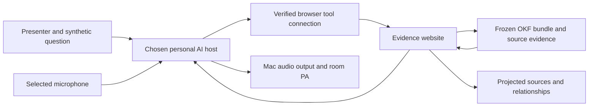

# Seminar website, WebMCP and audio plan

Assessment: 15 September 2026. Content freeze: 24 September 2026.
Seminar: 30 September 2026. Status: feasibility and acceptance plan; no new
website, deployment, audio routing or end-to-end voice test is delivered by
this document.

## Recommended demonstration

Build a small evidence website over the frozen `okf-dwp` bundle. A person and a
compatible personal AI should be able to find the same concept, inspect its
source passages and follow its evidenced relationships. Project the selected
evidence while the personal AI explains what it found, including uncertainty.

Keep the personal AI in the participant's chosen host. The website can serve
bounded evidence without hosting a general-purpose model. The owner has clarified that “Live 1” means **ChatGPT live voice**.
Current [ChatGPT Voice documentation](https://learn.chatgpt.com/docs/features/voice)
describes GPT-Live in the desktop app, including macOS and supported subscription
plans. Account/rollout availability and the actual voice-to-page-tool path still
need a rehearsal before it becomes the verified demonstration host. Voice output and a paid subscription
do not themselves establish WebMCP access.

This is the proposed integration. Each arrow needs an observed check; a working
browser page does not prove that the voice host has the tool connection.

## What is known now

| Layer | Evidence inspected | Current conclusion |
|---|---|---|
| DWP evidence | Existing YAML-LD bundle and next-stage concept work | Suitable foundation for a bounded evidence website; full legal correctness and whole-DMG semantic completion are separate goals. |
| Explorer | [AI access guidance at the inspected revision][explorer-ai] | Explorer provides evidence navigation. Its documentation does not claim a model runs inside Explorer or that a bundle URL automatically connects an AI. |
| Existing WebMCP exemplar | [govuk-webmcp source][tools-source] and [dated host observations][host-observations], read-only at `32f3d55bf34c4056a4b51b8fa00ad3c94a799d03` | Reusable implementation and evaluation patterns exist. Keep the submitted exemplar intact; build the DWP demonstration separately. |
| Current tool environment | Enabled tool metadata includes `mcp__playwright__browser_webmcp_list` and `mcp__playwright__browser_webmcp_call` | A dedicated WebMCP adapter is available in this task's tool inventory. No DWP-page inventory or invocation was performed in this assessment. Ordinary DOM and screenshot tools are separate capabilities. |
| Browser platform | [Current Chrome documentation][webmcp], reviewed on 15 September | WebMCP is a proposed standard with an origin trial from Chrome 149 and a local testing flag. Pin and test the actual browser/host combination. |
| Personal AI and voice | Owner clarified ChatGPT live voice; official desktop Voice documentation inspected | GPT-Live supports desktop voice and task coordination. Account availability and the actual DWP WebMCP/voice combination remain untested. |
| Room equipment | No room inspection or equipment inventory | Microphone, PA, projector, connectors, network and operator arrangements remain to be confirmed and rehearsed. |

The existing exemplar records successful direct calls through a named Chrome
DevTools harness, separate mixed personal-agent results and later successful
owner-directed observational journeys. These are useful precedents, not proof
that a different site, current browser session or voice product will work.
Its recorded host limitations must travel with any comparison.

## Browser and host boundary

Chrome currently documents imperative and declarative WebMCP APIs, visiting the
site to discover its tools, and origin-isolation and permissions-policy
requirements. A top-level public HTTPS page is the simplest demonstration
shape to assess. Verify any origin-trial registration and expiry for the actual
origin, or explicitly record local testing flags and a browser relaunch. Do not
present a flagged development setup as universal browser availability.
[Chrome WebMCP documentation][webmcp]

The existing exemplar registers imperative tools through
`document.modelContext.registerTool`. Follow the API documented for the pinned
browser build; do not assume older examples using other entry points are
interchangeable. Readiness text on the page establishes only the page's own
registration claim. The chosen host must enumerate the tools and successfully
invoke them. A browser extension connection exposing only page assets or CDP
is not evidence of a callable WebMCP bridge.

WebMCP concerns interaction with a visited page. A separately deployed MCP
server is another integration option, not an automatic capability of the
website or a substitute to relabel as WebMCP. Select it only if the clarified
personal AI requires that architecture. [Chrome's MCP comparison][compare]

The website's model-free delivery also does not mean a remote personal AI runs
locally or costs nothing: prompts and tool results may go to its provider.
Use synthetic demonstration questions and record the actual subscription and
host arrangement once identified.

## Proposed first website slice

Use the same deterministic query layer for the human interface and page tools.
Suggested contracts below are design proposals, not registered tool names.

| Proposed tool | Input and result | Effect |
|---|---|---|
| `dwp_search` | Bounded search terms and filters; exact record IDs, titles, source roles and snapshot | Read-only |
| `dwp_get_record` | Exact route; concept or passage with provenance, source links and limits | Read-only |
| `dwp_get_relationships` | Exact route and bounded predicate filter; directed assertions with evidence and review state | Read-only |
| `dwp_get_source_evidence` | Exact evidence ID; chapter, paragraph/page locator, capture hash and official URL | Read-only |
| `dwp_present_evidence` | Validated record/assertion IDs; selected evidence shown on the projected page | Reversible page-presentation change; not marked read-only |

Register tools only after the bundle, schema and digest checks pass. Use closed
input schemas, enforce bounds in executable validation and preserve source
text as inert data. Keep no claimant profile input and offer no entitlement,
award or application-submission tool. These constraints follow the DWP
exemplar's existing scope. Tool annotations must describe effects accurately;
Chrome also documents separate treatment for read-only and consequential
actions. [WebMCP tool security][security]

Show the source role, snapshot date, review status and missing-evidence state
beside the answer. Keep CPAG contents metadata distinct from acquired DWP
passages and unacquired statutory provisions. The projected page should make
the difference between a source fact and a project-proposed relationship easy
to see.

## Acceptance stages

| Stage and proposed timing | Required demonstration | Evidence to retain |
|---|---|---|
| Scope, 15–17 September | Confirm ChatGPT Voice account availability; select three synthetic journeys; agree the exact website/tool boundary and room contacts | Product/version/subscription record, journey IDs, expected tools and unresolved constraints |
| Human website, 18–20 September | Search, concept view, source passage, relationship view and deep link work with WebMCP unavailable | Build and bundle hashes; keyboard and projection checks; deterministic query receipts |
| Native tools, 20–21 September | Register expected tools, enumerate them, execute each contract and reject malformed/oversized input | Exact browser version, flags/trial state, tool schemas, arguments, returned IDs and digests |
| Personal AI in text mode, 21–22 September | Chosen host selects and calls page tools; visible evidence matches tool output; unsupported follow-up remains unsupported | Host/version, call trace where available, page state, source links, timings and limitations |
| Personal AI in voice mode, 22–23 September | Same host hears the question, calls the tools in that mode and speaks a source-bounded answer while the evidence appears on screen | End-to-end rehearsal record; voice/tool availability; measured delay, interruption and recovery results |
| Content freeze, 24 September | Freeze approved content and exact site/bundle bytes with a known working primary journey and fallback | Immutable candidate, validation results, pinned source census, run sheet and captioned recording |
| Room rehearsal, 25–29 September | Run the frozen journey on the intended MacBook, projector and PA; rehearse recovery | Actual device routes, operator roles, readable projection, room audio and network observations |
| Seminar, 30 September | Brief preflight; identify the demonstrated host, build and evidence limitations | Dated execution outcome; clearly label any switch to a recorded or manual route |

These dates are a proposed delivery sequence, not scheduled automation or a
claim that review slots and equipment are already booked. If native calls pass
but the personal AI cannot see the tool inventory, record a host integration
gap. Do not count DOM scraping, manual selection or a plausible spoken answer
as a successful WebMCP test.

For each of the three demonstration journeys, retain a deterministic source
baseline independently of model wording. Suggested journeys are capital
disregards, a change of circumstances and the boundary between DMG, ADM and
Universal Credit guidance. Include one deliberately unsupported question so
the audience sees a useful limit as well as a success.

## ChatGPT Voice: confirmed product, rehearsal pending

The owner clarified the product on 15 September 2026. [Official documentation](https://learn.chatgpt.com/docs/features/voice) says GPT-Live coordinates conversations and work in the desktop app; voice in an existing Codex task uses its conversation and selected task model, subject to rollout. Voice can steer other tasks and follows their permissions. This supports the proposed architecture, but it does not independently prove that this voice session can call a particular website's WebMCP tools.

Recommended rehearsal route:

1. Open the DWP demonstration task in the ChatGPT desktop app on the MacBook.
2. Use **Start voice chat** where available. First-use microphone access and voice choice are interactive setup steps for the presenter; no microphone or screen permissions were changed by this assessment.
3. Open the frozen evidence website through the connected supported browser and verify its exact tool inventory before the voice test.
4. Ask one synthetic question, inspect the actual tool call/result and confirm that the projected source agrees with the spoken answer.
5. Select and test Mac sound input/output with the venue operator. Re-test after connecting the projector, and test an interruption plus mute/recovery.

Screen context can provide an appshot when requested on macOS. It is optional and is not evidence of WebMCP invocation. Only one desktop voice chat can be active at a time; confirm the correct task is active. If the existing task lacks Voice because of rollout, assess a supported new voice chat route without claiming that dictation is equivalent.

[Current pricing documentation](https://learn.chatgpt.com/docs/pricing#how-much-does-voice-cost), checked 15 September 2026, lists desktop voice at $0.05 per minute against the existing Codex usage budget; task-model token usage is separate and shares the plan's limits. This is published pricing, not an observed bill or a benchmark of this demonstration. No paid voice run was started here.

## MacBook and room audio

macOS lets the operator select sound input and output separately in System
Settings → Sound. Available output devices can include the display, connected
audio equipment and wireless devices. Test the actual selected input and
output after connecting the projector; do not assume the previous route
remains selected. [Apple input settings][apple-input],
[Apple output settings][apple-output]

Room requirements to confirm with the AV operator:

- The MacBook model, available ports, projector input, resolution and required
  adaptors; power throughout the session.
- A deliberate microphone feed for the AI, plus the presenter's normal room
  microphone. Agree whether these are one shared feed or separate devices.
- A tested Mac audio output into the PA. Let the AV operator choose the suitable
  connection and levels for the room equipment.
- If the room mixer feeds the AI microphone input, exclude the AI's own output
  from that feed. Otherwise it may hear its own answer; test the actual setup.
- A reachable mute control and named person responsible for audio recovery.
- A clear projected evidence panel and visible text equivalent of the answer.
  Rehearse any host captions rather than assuming captions are available.
- Reliable network access for the selected AI host and public site, with the
  venue's connection restrictions known in advance.

Rehearse spoken technical terms, quiet and loud questions, an interruption,
one tool failure and one network failure. Test that the audience hears the AI
clearly without feedback and can read the source evidence from the back of the
room. Record results; no audio-system settings or microphone permissions were
changed by this assessment.

## Fallback that preserves the demonstration

Prepare three artefacts at content freeze:

1. A working manual evidence journey over the same frozen site and bundle.
2. A short captioned recording of a genuinely completed tool-and-voice journey,
   labelled with its date, host and build. If voice never passes, record only the
   verified interaction and label its narrower scope.
3. A local, readable evidence pack and run sheet with the selected questions,
   source passages, relationship IDs and limitations.

If the live host fails, state the failure and switch visibly to the appropriate
fallback. A prerecorded voice clip must not be presented as a live answer, and
a manual source selection must not be presented as an agent tool call. The
evidence story should remain useful even when the conversational layer fails.

## Open decisions

- Installed ChatGPT desktop version, account/rollout availability, subscription
  allowance and the exact task/browser connection for the voice session.
- Whether the selected task can invoke the DWP page tools while GPT-Live handles
  the conversation, with the returned evidence visible on the projected page.
- Agreed hosting location for the new DWP website and its exact publication
  scope. No site was created or published in this assessment.
- Room AV contact, equipment and rehearsal slot; recording and audience-question
  arrangements if recording is desired.
- Policy/domain reviewer availability and the three source-bounded journeys to
  freeze on 24 September.

[explorer-ai]: https://github.com/chris-page-gov/okf-explorer/blob/167d54dd924ce496f173105a8b390744b3b2a311/docs/ai-okf-usage.md
[tools-source]: https://github.com/chris-page-gov/govuk-webmcp/blob/32f3d55bf34c4056a4b51b8fa00ad3c94a799d03/src/webmcp-tools.ts
[host-observations]: https://github.com/chris-page-gov/govuk-webmcp/blob/32f3d55bf34c4056a4b51b8fa00ad3c94a799d03/PROJECT_STATUS.md
[webmcp]: https://developer.chrome.com/docs/ai/webmcp
[compare]: https://developer.chrome.com/docs/ai/webmcp/compare-mcp
[security]: https://developer.chrome.com/docs/ai/webmcp/secure-tools
[apple-input]: https://support.apple.com/en-gb/guide/mac-help/mchlp2567/mac
[apple-output]: https://support.apple.com/en-gb/guide/mac-help/mchlp2256/mac
