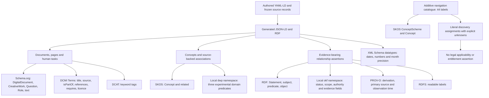

# Ontologies, vocabularies and concepts actually used

[Changes](../CHANGELOG.md) · [Discovery method](methodology.md) · [Backlog](backlog.md)

An **ontology** defines categories and relationships. A **vocabulary** can be a
smaller set of terms. A **namespace** gives those terms stable identifiers. A
declared namespace does not prove that its terms are used, that an ontology was
imported, or that a reasoning engine applies it. This project uses a small set
of established metadata and concept vocabularies, with explicit local terms.
It does not import a complete benefits or legal ontology.

## Implemented namespace map

This `flowchart TD` shows implementation responsibilities. Its arrows mean
“uses these terms”; they are not additional benefit or legal assertions.

## Actual use and evidence

The pinned [JSON-LD context](../profiles/bundle-wiki/v1/context.jsonld),
[semantic compiler](../scripts/semantic_authoring.py),
[generated pilot graph](../bundle/okf-bundle.jsonld) and
[full-DMG semantic manifest](../full-dmg/data/semantic/manifest.json) are the
implementation evidence. The [machine-readable namespace audit](../validation/navigation/ontology-use.json)
records the measured term use. Counts below describe the retained full-DMG semantic
shards before the additive navigation catalogue; they are not completeness scores.

| Namespace | Exact namespace IRI | Observed use |
| --- | --- | --- |
| `rdf` | `http://www.w3.org/1999/02/22-rdf-syntax-ns#` | Reification of 16,336 statements; subject/predicate/object preserve assertion identity |
| `rdfs` | `http://www.w3.org/2000/01/rdf-schema#` | Labels on relationship assertions |
| `skos` | `http://www.w3.org/2004/02/skos/core#` | 268 explicitly typed Concepts and 345 stored `related` relationships |
| `dcterms` | `http://purl.org/dc/terms/` | Document metadata; 15,074 `isPartOf`, 854 `references` and 59 `requires` relationship predicates |
| `prov` | `http://www.w3.org/ns/prov#` | Provenance, derivation, primary sources and time metadata |
| `schema` | `https://schema.org/` | 15,077 DigitalDocuments, 37 CreativeWorks, 14 Questions, 8 Roles and one nested Book reference; text and source URLs |
| `dcat` | `http://www.w3.org/ns/dcat#` | 3,715 `keyword` predicate uses for tags; no claim of a complete DCAT catalogue profile |
| `xsd` | `http://www.w3.org/2001/XMLSchema#` | Typed values; publication month precision is preserved rather than inventing a day |
| `okf` | `https://chris-page-gov.github.io/okf-explorer/ns#` | RelationshipAssertion plus governance, provenance and presentation fields |
| `dwp` | `https://chris-page-gov.github.io/okf-dwp/ns#` | Two `precedesAssessmentOf`, one `hasEvidenceRequirement`, one `hasDisregardPeriod` relationship; pilot capture metadata also uses `sourceCapturedAt` |

These are stored statements, not a materialised logical closure. Runtime records
label 282 items “Concept”, while 268 have an explicit `skos:Concept` type in the
retained RDF; some older records lack that type. Do not add the counts together
or silently treat the difference as a second ontology. The CPAG Book is a
metadata reference, not handbook-body evidence.

[SKOS](https://www.w3.org/TR/skos-reference/) provides concept organisation and
associations. This implementation's stored association does not establish legal
equivalence. [PROV-O](https://www.w3.org/TR/prov-o/) supplies provenance terms;
having provenance does not make an interpretation correct. Official vocabulary
references were checked on 19 September 2026; local counts come from the frozen
artefacts, not the vocabulary specifications.

## Additive conceptual navigation

The new [navigation catalogue](../domain-profile/navigation/catalogue.yamlld)
contains 44 project-authored labels: 20 benefits, 10 circumstances and 14 topics.
The [navigation manifest](../full-dmg/context/navigation/manifest.json) accounts
for all captured pages; literal matches and existing cited concept links are
discovery evidence. An unknown classification remains explicit. These assignments
do not mean a benefit rule applies to a person or that the page completely covers
the topic. Existing concept IRIs are retained rather than rewritten.

Three different observations must stay distinct: **the text contains literal
X**; **an existing project concept cites page Y**; and **reviewed guidance applies
to benefit Z**. The navigation producer supplies the first two, with their
evidence. It does not establish the third. It deliberately does not generate
page `schema:about`, `skos:related` or `appliesTo` assertions from lexical hits:
an example, footnote, exclusion or coincidental phrase may mention a benefit
without making the whole page its guidance. The assignments remain governed
runtime facets; the label catalogue uses SKOS separately.

Examples such as Benefit, BenefitVariant, Claimant, Circumstance, LegalCustody,
Entitlement, Payment, Disqualification and DecisionRule are **modelling questions**.
Their presence in requirements or prose does not mean they are formal OWL
classes. The [semantic pilot contract](next-stage/semantic-contract.md) states
the meaning and evidence requirements for the local predicates actually emitted.
Neutral cross-benefit definitions and review are tracked as **DWP-BL-005**.

The [staff and household increments](semantic-expansion.md) add 51 source-backed
concept proposals, including neutral benefit and benefit-variant meanings,
using SKOS `related` and `broader` and Dublin Core `references`. It retains
the earlier namespace audit unchanged. The 40 task profiles are executable
context requirements, not an OWL benefits ontology. Their 203 missing obligations
are explicitly absent evidence. Legal citation links identify provision references;
reference metadata does not become statutory text or an applicability rule. Twenty selected statutory units now have separate derived evidence records and 43 source-backed references, using the same Dublin Core vocabulary. No additional legal ontology or applicability predicate is invented for them.

The household qualification increment also uses the existing Dublin Core
`requires` term for eight explicit support dependencies. Seven captured pages
must accompany the complete household summary, and the care-home overview needs
that summary. These are authored context needs with evidence and review status;
they do not assert that a benefit is payable or that a legal rule applies.

## Declared or researched, but not implemented as claimed semantics

| Item | Current boundary |
| --- | --- |
| ELI and OWL | Prefixes are present in the reusable context; no ELI or OWL predicate/type use was found in the inspected canonical full-DMG RDF. No `owl:sameAs` or OWL inference is claimed. |
| SHACL | Researched, not a completed SHACL conformance gate for this publication. JSON Schema validation is a different check. |
| RDFC-1.0 | Researched. The existing build uses URDNA2015; byte SHA-256 and an RDF canonicalisation method are different claims. |
| YAML-LD | Selected representation with a pinned Working Draft reference; not a claim of complete processor-suite conformance. |
| Legal ontology / UK legislation integration | External catalogue references and an integration assessment exist; no complete provision/effects or benefits-law ontology is imported. |
| Full domain applicability model | Benefit, date, territory, exception and operational-evidence review remain incomplete; graph density is not a quality target. |

For another department, repeat discovery of its native terms and standards.
Reuse the proven metadata stack where appropriate; do not copy local DWP
predicates or benefit concepts as if they were universal.
