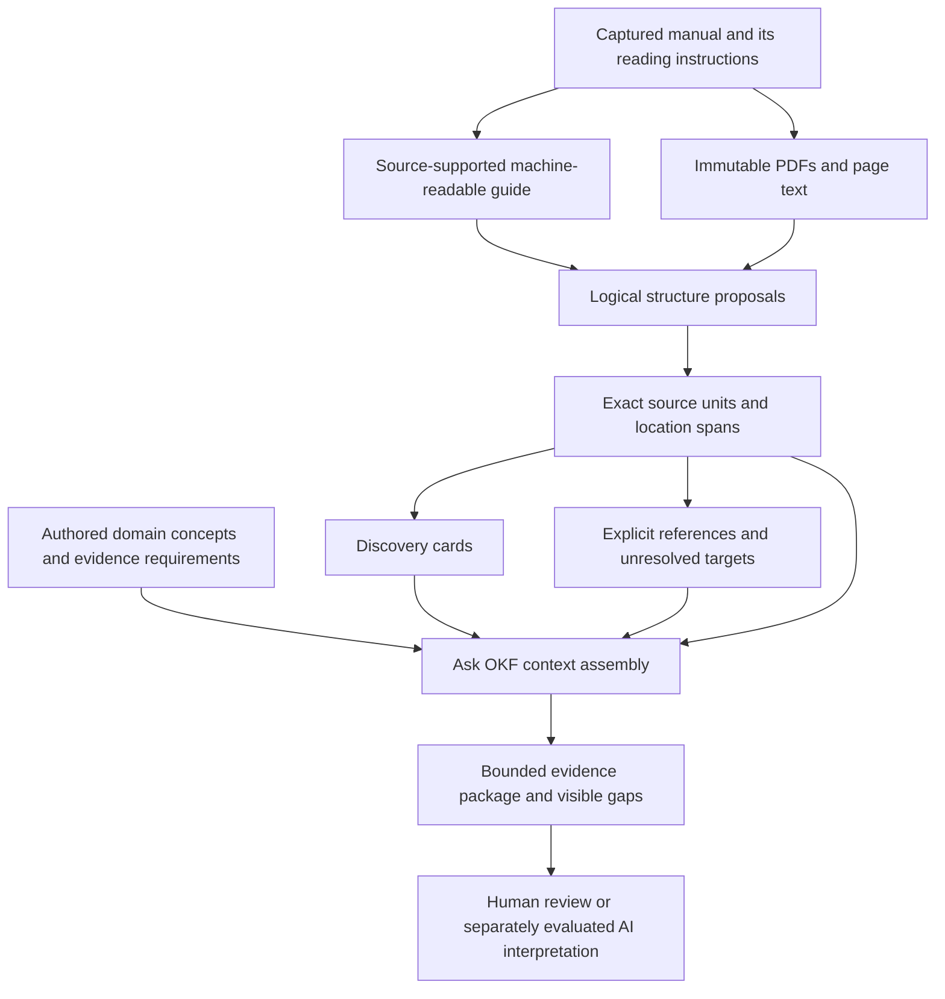

# From a manual to inspectable evidence

This page explains the new source-led build in plain English. It is an independent
research method, not official DWP guidance or a guide to deciding an individual's
benefit entitlement. Its implementation is being evaluated on the captured DMG
and ADM. Public release and answer quality have separate acceptance checks.

## 1. Start with the manual's own instructions

**DMG** means *Decision makers' guide*. **ADM** means *Advice for decision making*.
They are staff guidance collections. They have different scopes, numbered
paragraph systems, abbreviation lists, contents lists and update conventions.
A recently captured document is not necessarily recently published or currently
applicable.

The [machine-readable manual guide](../manual-guide/guide.json) records
source-supported reading conventions. Its [document catalogue](../manual-guide/documents.jsonl)
accounts for every captured document and preserves its original classification.
For example, a historical amendment stays a historical amendment. It does not
become a current rule because it matches a question.

**Machine-readable** means that software can inspect the same structured fields
that a person can read. **YAML-LD** combines a readable data format with stable
identifiers and Linked Data relationships. The guide's authored input is
[guide.yamlld](../domain-profile/manual-guide/guide.yamlld). Each convention names
its scope and points to exact source text or separately identified PDF structure.

A complete catalogue of documents does not mean every convention or legal rule
has received specialist review. Unknowns are retained at document level.

## 2. Treat the page as a location

A PDF page says where text was found. It need not contain a complete thought.
A numbered paragraph may continue through conditions, footnotes and examples on
the next page. A contents list may mention a topic whose rule appears elsewhere.

The new build checks two kinds of structural evidence:

- **Source-declared tags:** headings, paragraphs, lists and tables embedded in
  the PDF. A tag describes the document's structure; it does not establish law.
- **Literal conventions:** paragraph labels, number ranges, explicit contents
  lists and other source-supported patterns. These provide a fallback where tags
  are absent or cannot be matched safely.

The original extracted text stays unchanged. Matching ignores some whitespace
and Unicode glyph differences only to locate a proposed tag. The resulting unit
still contains exact original text spans and hashes. Repeated headings that
cannot be located unambiguously remain unresolved.

A **hash** is a fingerprint of file contents. A **span** identifies an exact
start and end within the extracted text. Together they let a reviewer check
whether the supplied passage is the one the build inspected.

## 3. Separate discovery cards from evidence

A **discovery card** is a short navigation record: a label, governing headings,
an extractive preview and a link bound to the complete evidence record. The
preview is not an independently written legal summary and may omit conditions.
Its purpose is to help find the full passage.

The source and card are searched in separate ranking fields. **BM25** is a
length-aware text-ranking method: it weighs matching terms while accounting for
how long a record is. It does not decide whether a rule applies to a claimant.
Its parameters are fixed before the forty-question comparison.

Cards do not become domain concepts, source evidence or completeness requirements.
A future flip-card or SeeLinks interface can show the preview on the front and
the complete passage, provenance and relationships on the back. The underlying
separation is implemented first; a future interaction design is not claimed as
already delivered.

## 4. Follow references without inventing dependencies

A **reference** says that one passage points to another. A **dependency** says
that another item is needed to understand or establish a particular proposition.
Those are different assertions.

The build can normalise an explicit paragraph reference to a unique captured
paragraph target. It labels that edge as navigation. Multiple possible targets,
missing targets, legislation citations and unresolved update effects remain
visible in the review output. They do not automatically become legal prerequisites.

Existing authored concepts, evidence requirements, paths and open obligations
are preserved. A new source-reference graph does not silently certify a staff
question as answerable.

### Keep conditional routes conditional

A topic such as capital can occur in several benefits. A route selected for
Pension Credit and capital should require both concepts to be resolved. The
new **context guard** records that condition explicitly. It controls navigation;
it is not a legal eligibility test. A literal search can still find another
benefit's passage, with its separate search reason and source scope.

The older page-based research profiles are also valuable leads. The migration
maps their exact source locations to complete new units and labels those routes
**location overlap only**. A new route inferred from a profile's candidate
selection is distinguished from an existing authored route. Neither closes an
old evidence requirement merely because some text overlaps. The original
requirements and unresolved obligations remain available for review.

## 5. Assemble first, deliver in bounded reads

The **assembly budget** limits how much context can be selected together. The
**delivery budget** limits each response sent to a browser or AI client. They
need not have the same size. A question with several conditions and exceptions
may need a larger assembly, delivered through several smaller exact reads.

In the first forty-question experiment, a 32 KiB assembly contained no source
evidence in the new corpus: the explanations and unresolved obligations already
used the available space. That result is retained as a failure. A short card
cannot stand in for the missing evidence. Hash-bound metadata references reduce
duplication, while the selected source, relationships and unresolved obligations
remain inspectable. The build still reports when the chosen assembly budget is
too small.

**KiB** means 1,024 bytes. An **exact read** requests identified content from a
specific source version and checks its hash. It does not ask an AI to fill in
an omitted passage from memory.

## 6. Understand the four checks

| Check | What it establishes | What it does not establish |
| --- | --- | --- |
| Source accounting | All captured documents, pages and original text bytes are accounted for | Complete acquisition of every relevant law or future update |
| Structural acceptance | Fixed examples preserve headings, complete passages and structural roles | Correct boundaries everywhere in the corpus |
| Context evaluation | What the same engine retains for each fixed question and budget | Independent relevance, legal answerability or model answer quality |
| Publication acceptance | The exact tested version is available through the public routes | Compatibility with a client that has not been observed using it |

The structural experiment starts with four source cases. After they pass, it
runs eight. Earlier failures and subsequent independent controls are retained in
[the evaluation record](manual-structure-evaluation.md). The separate full-corpus
run accounts for all 513 documents; the context comparison uses all forty staff
question occurrences. Duplicate or related questions are not treated as forty
independent tests of generalisation.

## The build at a glance



## Reproduce the stages

Use the locked dependencies described in the [repository README](../README.md).
The normal verification commands reuse retained structural observations and do
not call Poppler or acquire sources again:

```sh
uv sync --locked
uv run --locked python scripts/build_pdf_structure.py --check
uv run --locked python scripts/build_manual_guide.py --check
uv run --locked python scripts/build_structured_units.py --check
uv run --locked python scripts/build_structured_context.py --check
```

The [process plan](manual-structure-process.md) explains ownership and release
gates. The [PDF observation record](../pdf-structure/README.md) documents the
bounded parser correction and the retained failed observation. The [learning path](learning-path.md) provides wider project context.
The [ontology guide](ontology-use.md) shows the vocabularies actually used and
explains the difference between a declared namespace and an implemented model.

## What still needs review

Complete source accounting is achieved for this captured corpus. Boundary and
semantic review remain incomplete. A [concrete review queue](../evaluation/manual-structure/final-source-review/large-paragraph-triage.json)
identifies 28 paragraph candidates larger than 15 KB; a large table or example
may be legitimate, so size alone is not an error verdict. Fine memo numbering,
ambiguous headings, literal reference destinations and legal qualifications
also remain explicit review work. The [backlog](backlog-work-packages.md) keeps
these tasks separate from source processing and public publication.
